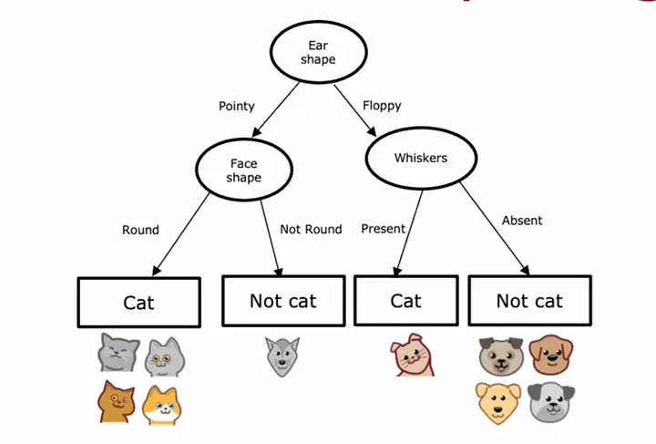
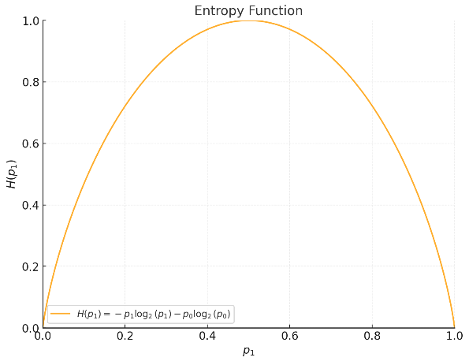
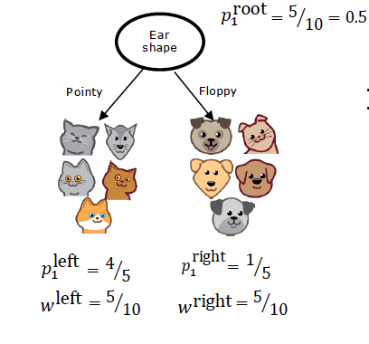
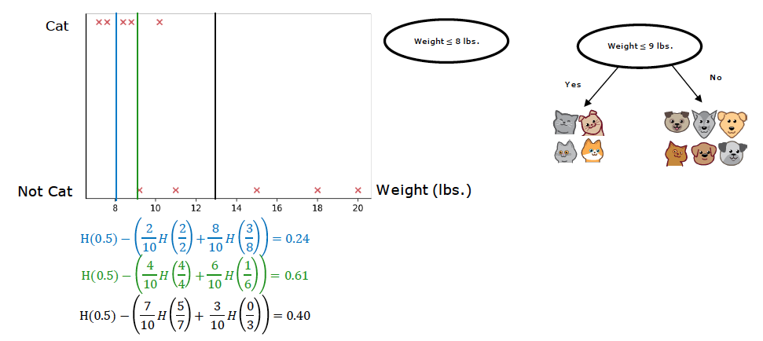
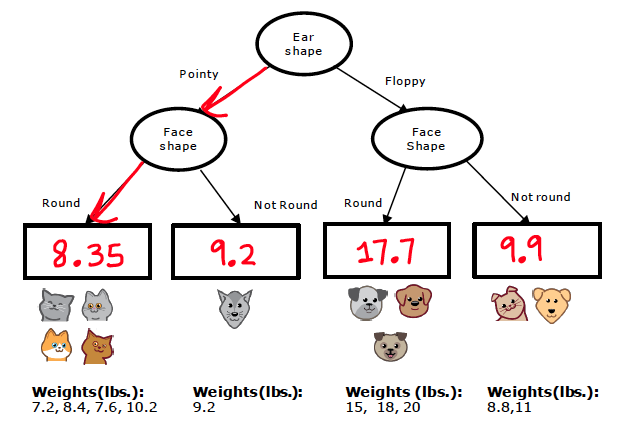
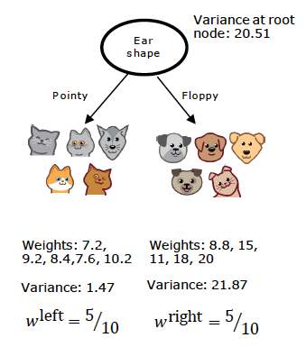
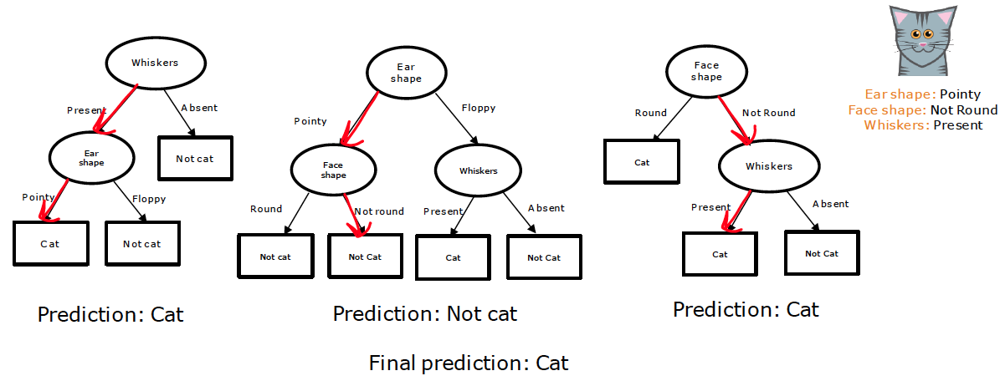

# Decision Trees

- [Decision Trees](#decision-trees)
  - [Entropy as a measure of impurity](#entropy-as-a-measure-of-impurity)
  - [Information Gain](#information-gain)
  - [Decision Tree Learning Algorithm (Recursive Splitting)](#decision-tree-learning-algorithm-recursive-splitting)
  - [Features with Multiple Classes](#features-with-multiple-classes)
    - [One-Hot Encoding](#one-hot-encoding)
  - [Splitting Continuous Variables](#splitting-continuous-variables)
  - [Regression with Decision Trees](#regression-with-decision-trees)
  - [Tree Ensembles](#tree-ensembles)
    - [Bagging (Bootstrap Aggregating)](#bagging-bootstrap-aggregating)
    - [Random Forest Algorithm](#random-forest-algorithm)
    - [Gradient Boosting](#gradient-boosting)
    - [XGBoost](#xgboost)
    - [Decision Trees vs Neural Networks](#decision-trees-vs-neural-networks)


Decision trees are used for classification and regression. They are easy to interpret and visualize. They can handle both numerical and categorical data.

A decision tree is a tree where each node represents a feature (ear shape, face shape, whiskers), each branch represents a decision, and each leaf represents an outcome.



There are multiple possible decision trees for a dataset. The job of the learning algorithm is to find the best tree that fits the training data and generalizes well to new, unseen data.

**Decision 1**: How to split the data at each node. 
- The goal is to maximize purity (or minimize impurity) at each node. Ideally, if there where only two classes, one class would be in one leaf and the other class in the other leaf.

**Decision 2**: When to stop splitting the data. 
- When a node is considered pure, 100% of the data belongs to one class
- When the tree reaches a maximum depth.
- When improvements in purity score are below a certain threshold.
- When then number of samples in a node is below a certain threshold.

## Entropy as a measure of impurity

**Entropy** is a measure of impurity in a dataset. 

**Purity** is the opposite of impurity. A dataset is pure if all the data belongs to the same class. A dataset is impure if the data is evenly distributed among the classes.

- $p_1$ is the proportion of examples in class. E.g. fraction of examples that are cats.
- $p_0$ is the proportion of examples that or not in the class. E.g. fraction of examples that are not cats.

```math
p_0 = 1 - p_1
```

```math
H(p_1) = -p_1 \log_2(p_1) - p_0 \log_2(p_0)
```



Examples:

- 80% of the examples are cats and 20% are not cats: p1 = 0.8 and H(p1) = 0.72
- 50% of the examples are cats and 50% are not cats: p1 = 0.5 and H(p1) = 1.0
- If either all the examples are cats or none of the examples are cats, the entropy is 0.

## Information Gain

**Information gain** is the reduction in entropy or impurity. The goal is to reduce the entropy at each node.

```math
\text{Information Gain} = \text{Entropy(parent)} - \text{Weighted Average Entropy(children)}
```



- $p_1^{root}$ is the proportion of positive examples at the root node.
- $p_1^{left}$ and $p_1^{right}$ are the proportions of examples in class 1 at the left and right child nodes. E.g. fraction of examples that are cats.
- $w^{left}$ and $w^{right}$ are the weights of the left and right child nodes. E.g. $w^{left}$ is the samples in the left child node divided by the total number of samples from the parent node.
- $H(p_1)$ is the entropy at the node.

```math
\text{Information Gain} = H(p_1^{root}) - (w^{left} H(p_1^{left}) + w^{right} H(p_1^{right}))
```

## Decision Tree Learning Algorithm (Recursive Splitting)

1. Start with all examples at the root node
2. Calculate information gain for all possible features, and pick the one with the highest information gain
3. Split dataset according to selected feature, and create left and right branches of the tree
4. Keep repeating the splitting process until a stopping criteria is met:
      - When a node is 100% one class
      - When splitting a node will result in the tree exceeding a maximum depth
      - Information gain from additional splits is less than threshold
      - When number of examples in a node is below a threshold

After deciding on the root node, the algorithm is recursively applied to each child node. Each child node repeats the process of selecting the feature on a subset of the data from the parent node.

## Features with Multiple Classes

Features with multiple classes create multiple branches in the tree. E.g. ear shape (pointy, round, floppy) creates three sub branches.

| Ear shape | Face shape | Whiskers | Cat |
|-----------|------------|----------|-----|
| Pointy    | Round      | Present  | 1   |
| Floppy    | Round      | Absent   | 0   |
| Oval      | Round      | Absent   | 1   |
| Floppy    | Not round  | Absent   | 0   |

### One-Hot Encoding

One-hot encoding converts a feature with multiple classes into multiple binary features.

Example for ear shape with three classes (pointy, round, floppy):

| Ear shape | Face shape | Whiskers | Pointy | Floppy | Oval   | Cat |
|-----------|------------|----------|--------|--------|--------|-----|
| Pointy    | Round      | Present  | 1      | 0      | 0      | 1   |
| Floppy    | Round      | Absent   | 0      | 1      | 0      | 0   | 
| Oval      | Round      | Absent   | 0      | 0      | 1      | 1   |
| Floppy    | Not round  | Absent   | 0      | 1      | 0      | 0   |

If a categorical feature has k classes, one-hot encoding will create k binary features.

With one-hot encoding, the decision tree algorithm can handle features with multiple classes with a binary split.

## Splitting Continuous Variables

Continuous features can have any value in a range. The decision tree algorithm tries different split points to find the best split with the highest information gain.



Split points are typically choosen by sorting the unique values and then calculate the average of two consecutive values.

```math
x_{\text{split}} = \frac{x_i + x_{i+1}}{2}, \quad \text{for } i \in \{1, 2, \ldots, n-1\}.
```

## Regression with Decision Trees

If the value to predict is continuous, the decision tree is used for regression. The process for the learning algorithm is the same as for classification, but the impurity measure is different.

In the example instead of trying to predict cat or not cat, the decision tree tries to predict the weight of the animal. For unseen data, the decision tree will predict the weight of the animal based on the average weight of the animals in the leaf node.



For regression, instead of entropy, the variance is used as a measure of impurity. The goal is to minimize the variance of the target variable at each node.



The data at a node is split to minimize the variance of the target variable. The variance is calculated as the average of the squared differences between the target variable and the mean of the target variable.

```math
\text{Variance} = \frac{1}{n} \sum_{i=1}^{n} (y_i - \bar{y})^2
```

The split enusres that each leaf node has a lower variance than the parent node.

```math
\text{Variance}_{parent} > \text{Weighted Variance}_{children}
```

Weighted variance of the children is the average of the variance of the left and right child nodes. $n$ is the number of examples in the parent node, $n_{\text{left}}$ and $n_{\text{right}}$ are the number of examples in the left and right child nodes.

```math
\text{Weighted Variance}_{childeren} = \frac{n_{\text{left}}}{n} \text{Variance}_{left} + \frac{n_{\text{right}}}{n} \text{Variance}_{right}
```

Calculate the variance reduction:
  
```math
\text{Variance Reduction} = \text{Variance}_{parent} - \text{Weighted Variance}_{children}
```

## Tree Ensembles

One weakness of using a single decision tree is that it can be sensitive to small changes in the training data. Small changes in the data could lead to a completely different tree. One solution is to use multiple decision trees and combine their predictions.



Hyperparameters to tune:
- Number of trees $B$
- Number of features $k$
- Maximum depth of the tree
- Minimum number of samples required to split a node
- Minimum number of samples required at each leaf node

### Bagging (Bootstrap Aggregating)

Bagging uses sampling with replacement (bootstrap) to create multiple datasets. Each dataset contains a subset of the examples and features. And example can be used multiple times in the dataset. Each dataset is used to train a another decision tree.

- Given training set of size 𝑚
  - For $b$ = 1 to $B$:
    - Use sampling with replacement to create a new training set of size 𝑚
    - Train a decision tree on the new dataset

$B$ is typically in the range of 64 to 128.

### Random Forest Algorithm

In addition to bagging, Random Forest introduces randomness. At each node, when choosing a feature to use to split, if $n$ features are available, pick a random subset of $k < n$ features and allow the algorithm to only choose from that subset of features.

- Given training set of size 𝑚
  - For $b$ = 1 to $B$:
    - Use sampling with replacement to create a new training set of size 𝑚
    - Train a decision tree on the new dataset, but at each node:
      - Randomly select a subset of features of size $k$.
      - Choose the best feature to split on from the subset of features

$k$ is typically the square root of the number of features. Used when the number of features is large.

### Gradient Boosting
The algorithm iteratively adds trees to correct the errors from the previous trees, each new tree aims to correct the errors made by the previous ones. Instead of sampling with replacement, the algorithm samples the examples with weights. Examples that are misclassified have a higher weight.

- Start with a constant model that predicts the mean of the target variable for regression tasks or the most frequent class for classification tasks.
- For $b$ = 1 to $B$:
  - Calculate the difference between the actual target values and the current model’s predictions. These differences are known as residuals.
  - Train a new decision tree to predict these residuals. This tree focuses on the errors made by the previous trees
  - Add the new tree to the existing ensemble with a scaling factor (learning rate) to control the contribution of the new tree.

The final model is the sum of the initial model and all the trees added during the iterations.

Details of the Gradient Boosting Algorithm for Regression:

1. Initial Prediction: 

```math
F_0(x) = \text{mean}(y)
```
2. Compute the residuals $r_i$ for each data point (difference between the actual target value and the current model’s prediction): 
```math
r_i = - \left[ \frac{\partial L(y_i, F_{m-1}(x_i))}{\partial F_{m-1}(x_i)} \right]
```
For squared error loss function, it is simply the difference between actual target value and the current model’s prediction:
```math
r_i = y_i - F_0(x_i)
```
3. Train  weak learner (decision tree) $h_1(x)$ to predict the residuals $r_i$ instead of the target $y$ using the input features $x_i$
```math
h_1(x) = \text{argmin}_{h} \sum_{i=1}^{m} (r_i - h(x_i))^2
```
4. Update the model $F_1(x)$ with the new tree $h_1(x)$ and a learning rate $\alpha$ (e.g. 0.1):
```math
F_1(x) = F_0(x) + \alpha h_1(x)
```
5. Compute the residuals $r_i$ for the new model:
```math
r_i = y_i - F_1(x_i)
```
6. Continue training new trees (step 3) and updating the model until the residuals are small or a stopping criteria is met.

### XGBoost

XGBoost is a popular implementation of the gradient boosting algorithm. XGBoost builds upon the gradient boosting framework, which constructs an ensemble of decision trees sequentially. Each new tree aims to correct the errors made by the previous ones.

### Decision Trees vs Neural Networks

Decision Trees:
- Work well on tabular (structured) data
- Not recommended for unstructured data (images, audio, text)
- Decision tree models are fast to train and easy to interpret

Neural Networks:
- Work well on all types of data, including tabular (structured) and unstructured data (images, audio, text)
- Maybe slow to train and require a lot of data
- Work with transfer learning and pre-trained models
- When building a system of multiple models working together, it might be easier to string together multiple neural networks
