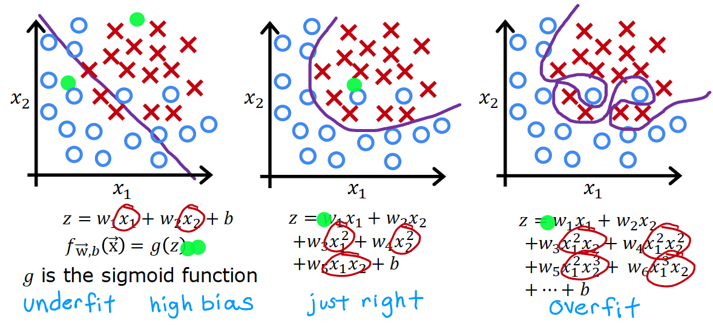
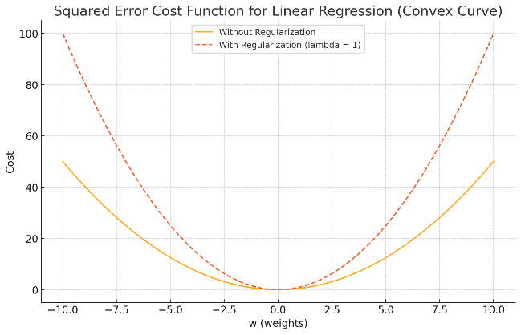
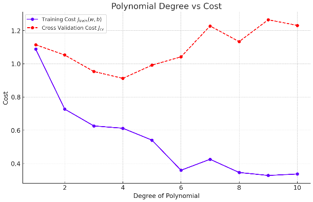
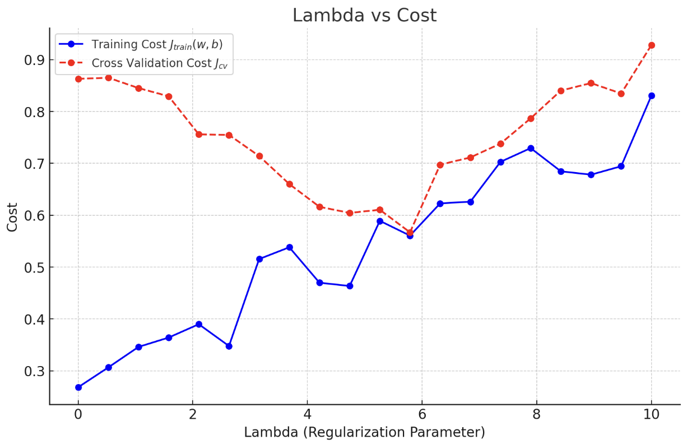
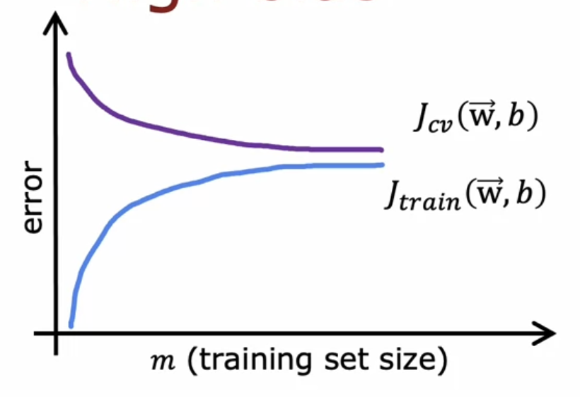
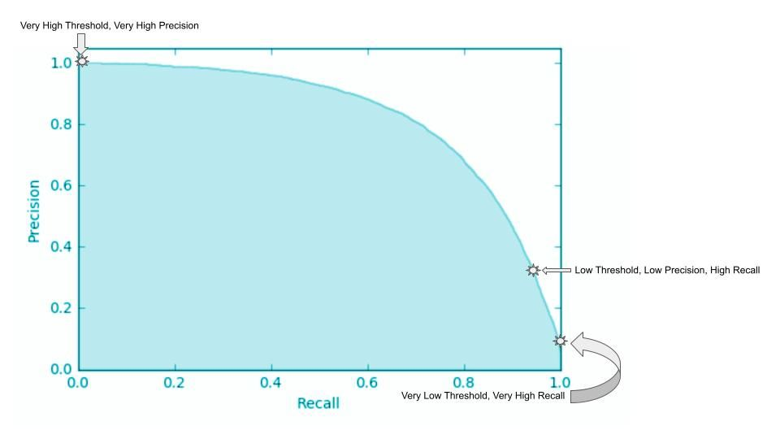

# Model Evaluation and Improvement Techniques

- [Model Evaluation and Improvement Techniques](#model-evaluation-and-improvement-techniques)
  - [Evaluating the Model](#evaluating-the-model)
    - [The Problem of Overfitting and Underfitting](#the-problem-of-overfitting-and-underfitting)
    - [Regularization to Reduce Overfitting](#regularization-to-reduce-overfitting)
      - [Neural network regularization](#neural-network-regularization)
    - [Train test prodcedure for linear regression](#train-test-prodcedure-for-linear-regression)
    - [Train test prodcedure for logistic regression](#train-test-prodcedure-for-logistic-regression)
    - [Cross-Validation](#cross-validation)
      - [K-Fold Cross-Validation](#k-fold-cross-validation)
      - [R2 Score](#r2-score)
    - [Diagnosing Bias and Variance](#diagnosing-bias-and-variance)
    - [Baseline level of performance](#baseline-level-of-performance)
    - [Learning Curves](#learning-curves)
    - [Bias and Variance in Neural Networks](#bias-and-variance-in-neural-networks)
    - [Precision and Recall](#precision-and-recall)
      - [Trade off between precision and recall](#trade-off-between-precision-and-recall)
      - [F1 Score](#f1-score)
  - [Machine Learining Development Process](#machine-learining-development-process)
    - [Data Augmentation](#data-augmentation)
    - [Data Synthesis](#data-synthesis)
    - [Transfer Learning](#transfer-learning)

## Evaluating the Model

If the model makes large errors in predictions (underfitting, high bias), make the model more complex:

- Try getting additional features
- Try adding polynomial features
- Try decreasing 𝜆

If the model fits the data to well (overfitting, high variance), make the model simpler:

- Get more training examples
- Try smaller sets of features
- Try increasing 𝜆

### The Problem of Overfitting and Underfitting

- A model with high bias does not fit the training set well. It is called underfitting.
- If it has a high variance, it fits the training set too well and does not generalize to new data. It is called overfitting.

Regression 

Classification 

### Regularization to Reduce Overfitting

- Collect more training data is the best solution.
- Select only the most important features based on intuition or domain knowledge.
- Reduce the weight of the less important features.

Regularization adds a penalty term to the cost function to reduce the complexity of the model. It discourages the weights from becoming too large, which can lead to overfitting.

L2 Regularization (Ridge)

$$
J(\vec{w}, b) = \frac{1}{2m} \sum_{i=1}^{m} \left( f_{\vec{w}b}(\vec{x}^{(i)}) - y^{(i)} \right)^2 + \frac{\lambda}{2m} \sum_{j=1}^{n} w_j^2
$$

- $\lambda$ is the regularization parameter that controls the strength of the regularization.
- m is the number of training examples and n the number of features or weights.
- i refers to the training examples and j to the features or weights.
- if lambda is zero, the regularization term has no effect.
- the parameter $b$ is not regularized but can be included in the regularization term as well.
- higher order features usually have larger weights, those features typically end up being more penalized by the regularization term.

Gradient Descent with L2 Regularization:

$$
\vec{w} := \vec{w} - \alpha \left( \frac{1}{m} \sum_{i=1}^{m} \left( f_{\vec{w}b}(\vec{x}^{(i)}) - y^{(i)} \right) \vec{x}^{(i)} + \frac{\lambda}{m} \vec{w} \right)
$$



The cost function (red line) increases the overall cost for large values of $w$.

#### Neural network regularization

```python
lam = 0.01

layer_1 = Dense(units=25, activation="relu", kernel_regularizer=L2(lam))
layer_2 = Dense(units=15, activation="relu", kernel_regularizer=L2(lam))
layer_3 = Dense(units=1, activation="sigmoid", kernel_regularizer=L2(lam))

model = Sequential([layer_1, layer_2, layer_3])
```


### Train test prodcedure for linear regression
Split the data into training $\vec{x}_{\text{train}}$ and test $\vec{x}_{\text{test}}$ sets. E.g. 70% training and 30% test.
The training set is used to train the model, and the test set is used to evaluate the model's performance on new, unseen data.

The parameters are fit by minimizing the cost function:
```math
J(\vec{w}, b) = \frac{1}{2m} \sum_{i=1}^{m} \left( f_{\vec{w}b}(\vec{x}^{(i)}) - y^{(i)} \right)^2 + \frac{\lambda}{2m} \sum_{j=1}^{n} w_j^2
```

Compute the test error (MSE):
```math
J_{\text{test}}(\vec{w}, b) = \frac{1}{2m_{\text{test}}} \sum_{i=1}^{m_{\text{test}}} \left( f_{\vec{w}b}(\vec{x}^{(i)}_{\text{test}}) - y^{(i)}_{\text{test}} \right)^2
```

Compute the training error (MSE):
```math
J_{\text{train}}(\vec{w}, b) = \frac{1}{2m_{\text{train}}} \sum_{i=1}^{m_{\text{train}}} \left( f_{\vec{w}b}(\vec{x}^{(i)}_{\text{train}}) - y^{(i)}_{\text{train}} \right)^2
```

- If the model is overfitting, the training error will be low and the test error will be hight.
- If the model is underfitting, both the training and test error will be high.

### Train test prodcedure for logistic regression

Binary classification with logistic regression:
```math
\hat{y} = 
\begin{cases} 
1 & \text{if } f_{w,b}(x^{(i)}) \geq 0.5 \\
0 & \text{if } f_{w,b}(x^{(i)}) < 0.5 
\end{cases}
```
Split the data into training $\vec{x}_{\text{train}}$ and test $\vec{x}_{\text{test}}$ sets. E.g. 70% training and 30% test. Count the misclassified examples where the predicted value $\hat{y} \neq y$.

Fraction of the test set and the freaction of the train set that the algorithm has misclassified:

```math
J_{\text{test}}(w, b) = \frac{\text{Number of misclassified examples in the test set}}{\text{Total number of examples in the test set}}
```

```math
J_{\text{train}}(w, b) = \frac{\text{Number of misclassified examples in the train set}}{\text{Total number of examples in the train set}}
```

### Cross-Validation

Cross-validation is used to estimate how well the model will generalize to new, unseen data.

Split the data into training $\vec{x}_{\text{train}}$ and test $\vec{x}_{\text{test}}$ and validation $\vec{x}_{\text{cv}}$ sets. E.g. 60% training, 20% test, and 20% cross validation, sometimes also called the validation or development set.

Training error (MSE):
```math
J_{\text{train}}(\vec{w}, b) = \frac{1}{2m_{\text{train}}} \sum_{i=1}^{m_{\text{train}}} \left( f_{\vec{w},b}(\vec{x}_{\text{train}}^{(i)}) - y_{\text{train}}^{(i)} \right)^2
```

Test error (MSE):
```math
J_{\text{test}}(\vec{w}, b) = \frac{1}{2m_{\text{test}}} \sum_{i=1}^{m_{\text{test}}} \left( f_{\vec{w},b}(\vec{x}_{\text{test}}^{(i)}) - y_{\text{test}}^{(i)} \right)^2
```

Cross validation error (MSE) (also called validation error, dev error):
```math
J_{\text{cv}}(\vec{w}, b) = \frac{1}{2m_{\text{cv}}} \sum_{i=1}^{m_{\text{cv}}} \left( f_{\vec{w},b}(\vec{x}_{\text{cv}}^{(i)}) - y_{\text{cv}}^{(i)} \right)^2
```

Given some models with different degrees of polynomial features:
```math
\begin{align}
  f_{w,b}(x) &= w_1 x_1 + b \\
  f_{w,b}(x) &= w_1 x_1 + w_2 x_2 + b \\
  f_{w,b}(x) &= w_1 x_1 + w_2 x_2 + w_3 x_3 + b
\end{align}
```

1. Fit the parameters of each model with the training set $\vec{x}_{\text{train}}$
2. Choose the model (degree of polynomial) with the lowest cross-validation error $J_{\text{cv}}(w, b)$ based on the validation set $\vec{x}_{\text{cv}}$
3. Estimate the generalization error $J_{\text{test}}(\vec{w}, b)$ on this model with the test set $\vec{x}_{\text{test}}$.

This way, step 1 and 2 are used to select the model parameters. Step 1 chooses w and b and step 2 choose the degree of the polynomial. The test set is not involved in this process and can then be used to estimate a fair generalization error (unseen data) of the model.

- For binary classification $J_{\text{cv}}(w, b)$ is the fraction of misclassified examples. 
- Cross-validation is also used to choose layers and neurons in a neural network.
- Important to note, when using z-score feature nomalization the mean and standard deviation from the training set is also used to normalize the test and cross-validation sets.

#### K-Fold Cross-Validation

Split the data into k equal-sized folds. Train the model k times, each time using a different fold as the validation set and the remaining k-1 folds as the training set.


- The cross-validation error is the average of the k cross-validation errors.
- K represents the number of folds.
- Choosing k = 5 or k = 10 is common. Higher values of k are more computationally expensive.
- Shuffle the data before splitting it into folds. This breaks any inherent order in the data. If the order is important, e.g. time series data, it should not be shuffled.

#### R2 Score

For regression, the R2 score is a measure of how well the model fits the data. 

```math
R^2 = 1− \frac{\text{Total Variation}}{\text{Unexplained Variation}}
```

```math
R^2 = 1− \frac{\text{SSres}}{\text{SStot}}
```

```math
R^2 = 1 - \frac{\sum_{i=1}^{n} (y_i - \hat{y}i)^2}{\sum_{i=1}^{n} (y_i - \bar{y})^2}
```

- $y_i$ : Actual values.
- $\hat{y}_i$ : Predicted values.
- $\bar{y}$ : Mean of the actual values.

Interpretation:
- $R^2$ = 1 : Perfect fit. The model explains all the variability in the data.
- $R^2$ = 0 : The model does not explain any variability in the data, equivalent to predicting the mean of the target variable for all inputs.
- $R^2$ < 0 : The model performs worse than a simple mean prediction.

### Diagnosing Bias and Variance

High bias (underfit)
- $J_{\text{train}}$ will be high
- $J_{\text{train}} \approx J_{\text{cv}}$

High variance (overfit)
- $J_{\text{cv}} \gg J_{\text{train}}$
- $J_{\text{train}}$ may be low

High bias and high variance
- $J_{\text{train}}$ will be high
- $J_{\text{cv}} \gg J_{\text{train}}$

Example for a polynomial regression model. First both the training and cross-validation error are high. The model is underfitting. Then the training error decreases as the degree of polynomial increases. The cross-validation cost first decreases as well, but then increases again. The model is overfitting. Best fit is when the cross-validation error is at minimum (4 degree).



Large $\lambda$ e.g. 10000
- High bias and low variance
- The model is underfitting
- w1, w2, w3, ... wn are close to zero

Small $\lambda$ e.g. 0.0001
- High variance and low bias ($\lambda$ has no effect)
- The model is overfitting
- w1, w2, w3, ... wn are large 

Choosing the regularization parameter $\lambda$ with cross-validation:

1. try a range of $\lambda$ values e.g. 0, 0.001, 0.01, 0.1, 1, 10, 100
2. fit the model with the training set $\vec{x}_{\text{train}}$
3. compute the cross-validation error $J_{\text{cv}}(w, b)$ with the cross-validation set $\vec{x}_{\text{cv}}$
4. Pick the $\lambda$ with the lowest cross-validation error
5. Estimate the generalization error $J_{\text{test}}(\vec{w}, b)$ with the test set $\vec{x}_{\text{test}}$

Bias and variance as a function of regularization parameter $\lambda$. With a small $\lambda$ the model has high variance, it is overfitting. With a large $\lambda$ the model has high bias and low variance, it is underfitting.



### Baseline level of performance

The baseline performance is the performance of a simple model or a human expert. It is used to compare the performance of the machine learning model. E.g. speak recognition model with 10.6% human error.

| Performance                                 | high variance | high bias | bigh bias and high variance|
|---------------------------------------------|---------------|-----------|----------------------------|
| Baseline performance (human)                | 10.6%         | 10.6%     | 10.6%                      |
| Training error $J_{\text{train}}(w, b)$     | 10.8%         | 15.0%     | 15.0%                      |
| Cross validation error $J_{\text{cv}}(w, b)$| 14.8%         | 15.5%     | 19.7%                      |

- **high variance**: difference between baseline and training error is low, but high between training and cross-validation error.
- **high bias**: difference between baseline and training error is high, but low between training and cross-validation error.
- **high bias and high variance**: difference is high between both baseline and training error and training and cross-validation error.

### Learning Curves

Learning curves are used to diagnose bias and variance, by plotting the training and cross-validation error as a function of the training set size.

Jtrain is low for small training set sizes, e.g. with only two data points the model can fit the data perfectly. The training error increases as the training set size increases.

Jcv is high for small training set sizes, the model does not generalize well. The cross-validation error decreases as the training set size increases.



The curve flattens out. This shows that if a learining algorithm has high bias, getting more training data will not help but for high variance, getting more training could possibly be helpful.

### Bias and Variance in Neural Networks

Large neural networks are low bias machines, they fit complex functions very well. If Jtrain is high try a larger network. If Jcv is high as well try to get more training data.

A larger neural network will usually do as well or better than a smaller one so long as regularization is chosen correctly. But larger networks are more computationally expensive.

### Precision and Recall

In a skews dataset, e.g. 99% of the data is class 0 and 1% is class 1, accuracy is not a good metric. A model that always predicts class 0 will have an accuracy of 99%. Precision and recall are better metrics.

E.g. A classifer for a rare disease. The model should have a high recall, it should not miss any positive cases. The precision should also be high, it should not predict a positive case when it is not.

| Actual \ Predicted | Positive | Negative |
|--------------------|----------|----------|
| Positive           | TP       | FN       |
| Negative           | FP       | TN       |

- **Precision**: The ratio of correctly predicted positive **observations** to the total predicted positives.
  ```math
  \text{Precision} = \frac{TP}{TP + FP}
  ```

  E.g. of all patients that tested positive, how many actually have the disease. If false positive is high, we predict a lot of patients that do not have the disease.

  ```math
  \text{Precision} = \frac{15}{15 + 5} = 0.75
  ```

  The precision of 0.75, means that 75% of the patients that tested positive actually have the disease.

- **Recall (Sensitivity)**: The ratio of correctly predicted positive observations to all observations in the actual class.
  ```math
  \text{Recall} = \frac{TP}{TP + FN}
  ```

  E.g. of all patients that have the disease, how many did we correctly predict. If fals negative is high, we miss a lot of patients that have the disease.

  ```math
  \text{Recall} = \frac{15}{15 + 10} = 0.6
  ```

  The recall of 0.6, means that 60% of the patients that have the disease were correctly predicted.

- **Accuracy**: The ratio of correctly predicted observations to the total observations.
  ```math
  \text{Accuracy} = \frac{TP + TN}{TOTAL} = \frac{TP + TN}{TP + TN + FP + FN}
  ```

  E.g. of all patients, how many did we correctly predict.

  ```math
  \text{Accuracy} = \frac{15 + 5}{15 + 5 + 10 + 20} = 0.5
  ```

  The accuracy of 0.5, means that 50% of the patients were correctly predicted. Accuracy pimarily measures the number of correct predictions and is not a good metric for skewed datasets.

#### Trade off between precision and recall

Logist regression:

```math
\hat{y} = \begin{cases} 1 & \text{if } P(y=1|\vec{x}) \geq 0.5 \\ 0 & \text{otherwise} \end{cases}
```

If the threshold is increased to e.g. 0.7, the precision will increase but we miss some positive cases, the recall will decrease.

The precision-recall curve shows the trade off between precision and recall for different thresholds. The threshold for an algorithm is often chosen manually based on the requirements of the problem.



#### F1 Score 

The F1 score combines precision and recall into a single metric. It is the harmonic mean of precision and recall. It is used when the classes are imbalanced.

```math
\text{F1 Score} = 2 \times \frac{\text{Precision} \times \text{Recall}}{\text{Precision} + \text{Recall}}
```

It can be used to compare different models. A model with a high F1 score has a good balance between precision and recall. 

| Algorithm  | Precision (P) | Recall (R) | F1 Score |
|------------|----------------|------------|----------|
| Algorithm 1| 0.5            | 0.4        | 0.44     |
| Algorithm 2| 0.7            | 0.1        | 0.18     |
| Algorithm 3| 0.02           | 1.0        | 0.04     |

Example: Algorithm 2 has a high precision but a low recall, algorithm 3 has a high recall but a low precision. Algorithm 1 has a good balance between precision and recall.

## Machine Learining Development Process

Iterative process to develop a machine learning model:

1. Choose architecture (model, data, features)
2. Train the model
3. Diagnostics (bias, variance and error analysis)

### Data Augmentation

Data augmentation is a technique used to increase the size of the training set by applying transformations to the data. It is used to reduce overfitting and improve the generalization of the model. E.g. flipping, rotating, scaling, cropping, and changing the brightness of images.

### Data Synthesis

Data synthesis is a technique using artificial data inputs to create new data. It is used when the training data is limited. E.g. generating new images of letters and numbers for OCR.

### Transfer Learning

Transfer learning is a technique where a model trained on one task with large amount of data is used as a starting point (supervised pretraining). This model and its parameters is then copied and used as a starting point for a new task. The model is then fine-tuned on the new task. 

Pre-trained models are available for image recognition, speech recognition, and natural language processing.

You can use an open source pre-trained neuronal network and just train the last layer for your specific task or use it as a starting point and train all parameters of all layers.
