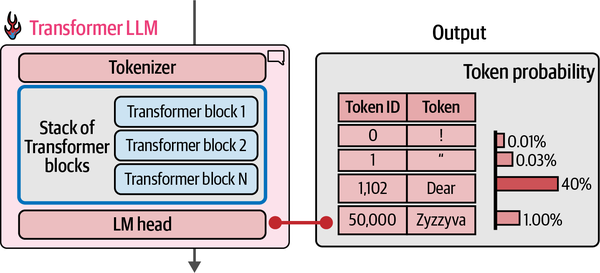

# Language Models

- [Language Models](#language-models)
  - [Representing Language in Structured Form](#representing-language-in-structured-form)
    - [Bag of Words (BoW)](#bag-of-words-bow)
    - [Dense Vector Embeddings word2vec](#dense-vector-embeddings-word2vec)
    - [Types of Embeddings](#types-of-embeddings)
    - [Encoding and Decoding Context with Attention](#encoding-and-decoding-context-with-attention)
    - [Attention is all you need](#attention-is-all-you-need)
    - [Training LLMs](#training-llms)
  - [Tokens and Embeddings](#tokens-and-embeddings)
    - [Tokenization](#tokenization)
    - [Token Embeddings](#token-embeddings)
    - [Text Embeddings](#text-embeddings)
  - [Transformer Model](#transformer-model)
    - [Tokenizer](#tokenizer)
    - [LM Head](#lm-head)
    - [Parallel Token Processing and Context Size](#parallel-token-processing-and-context-size)
    - [Transformer Blocks](#transformer-blocks)
    - [Self-Attention](#self-attention)
      - [Self-Attention Mechanism](#self-attention-mechanism)
      - [Multi-Head Self-Attention](#multi-head-self-attention)
      - [Positional Embeddings](#positional-embeddings)


Language models or large language models (LLMs) are a type of artificial intelligence model designed to understand and generate human language.

- **Representation model**s: LLMs that do not generate text but are used for task specific use cases, like classification, clustering, etc.
- **Generative model**s: LLMs that can generate text, such as ChatGPT, Bard, etc.

## Representing Language in Structured Form

Language is unstructured data and difficult to process for computers. Therefore, we need to represent language in a structured form. There are several ways to represent language in a structured form

### Bag of Words (BoW)
- A simple representation model of text data.
- Sentences are split by whitespace.
- A vocabulary is created from the unique words in the text.
- Each sentence is represented as a vector of word counts.
- Example:
  - Sentence: "that is a cute dog my cat is cute"
  - Vocabulary: ["that", "is", "a", "cute", "dog", "my", "cat"]
  - Vector: [1, 2, 1, 2, 1, 1, 1]


bag of words is a simple representation model but has several limitations:
- It does not consider the order of words.
- it does not consider the semantic nature of words.

### Dense Vector Embeddings word2vec
- A more advanced representation model of text data.
- Word2vec learns semantic representations of words by training on vast amounts of text data. E.g. Wikipedia
- It uses a neural network to learn the relationships between words in a corpus.
- word2vec generates word embeddings by looking at which other words appear next to in a sentence and learns the relationship between words.


For instance, the word “baby” might score high on the properties “newborn” and “human” while the word “apple” scores low on these properties.


In practice, these properties are often obscure and do not relate to single entity or humanly identifiable concepts.

Embeddings are fixed-length vectors that represent words in a continuous vector space. The distance between two word embeddings indicates the semantic similarity between the words. For example, the word embeddings for "king" and "queen" are closer together than the word embeddings for "king" and "carrot".

Embeddings of words that are similar will be close to each other in the vector space:


### Types of Embeddings
- **Word Embeddings**: Represent individual words in a continuous vector space. Examples include Word2Vec, GloVe, and FastText.
- **Sentence Embeddings**: Represent entire sentences or phrases in a continuous vector space.
- **Document Embeddings**: Represent entire documents in a continuous vector space. e.g. Bag of Words
- **Token Embeddings**: Represent individual tokens (words, subwords, or characters) in a continuous vector space. e.g. BERT, GPT-2, and RoBERTa

### Encoding and Decoding Context with Attention

Word2Vec creates static representations of words, meaning that the same word will always have the same representation, regardless of its context. This is a limitation because the meaning of a word can change depending on its context. E.g. bank can refer to a financial institution or the side of a river.

To address this and generate embeddings that are contextually aware, wei can use recurrent neural networks (RNNs). RNNs can process sequences of data. They are similar to traditional neural networks but have a feedback loop that allows them to maintain state. 

The RNNs are used for two tasks:

- **Encoding**: The RNN processes the input sequence and generates a fixed-length vector representation of the entire sequence. This vector captures the context of the entire sequence and is the input for the decoder.
- **Decoding**: The RNN generates the output sequence based on the encoded vector. This is typically done using a separate RNN that takes the encoded vector as input and generates the output sequence one token at a time.


**Attention**: Attention mechanisms allow the model to focus on specific parts of the input sequence when generating the output sequence. 

E.g. when generating a translation, the model can focus on the relevant words in the input sentence rather than treating all words equally. 


By adding the attention mechanism to the encoder-decoder architecture, we can create a more powerful model that can generate contextually aware embeddings. 

E.g. durning the generation of "Ik hou van lamas's" the RNN keeps track of the words it mostly attends to perform the translation. After generating the words “Ik,” “hou,” and “van,” the attention mechanism of the
decoder enables it to focus on the word “llamas” before it generates the Dutch translation


This architecture is autoregressive. When generating the next
word, this architecture needs to consume all previously generated words.

The sequential nature of RNNs makes them difficult to train, especially for long sequences. 

### Attention is all you need

Attention is all you need is a well-known paper where the authors proposed a new architecture called the Transformer. Compare to RNNs, the Transformer architecture is more efficient an can be trained in parallel. The Transformer architecture is based on the attention mechanism and does not use RNNs.

**Transformer encoder**

The encoder consists of a stack of identical layers. Each layer has two sub-layers:
1. A self-attention mechanism
2. A feed-forward neural network


**Transformer decoder**

The decoder also consists of a stack of identical layers. Each layer has three sub-layers:
1. A masked self-attention mechanism
2. Encoder attention mechanism that attends to the encoder's output
3. A feed-forward neural network


- Encoder-decoder together builds the transformer architecture.
- BERT is a transformer-based model that only uses the encoder part of the transformer architecture.
- Decoder-only models (generative models, or GPT generative pretrained transformer) like GPT-2 and GPT-3 use the decoder part of the transformer architecture

### Training LLMs

- **Language modeling**: The first step is pretraining (unsupervised) the model is trained on a vast amount of text data to learn the statistical properties of the language. The resulting model is often referred to as a  foundation model or base model. These models generally do not follow instructions and are not task-specific.
- **Fine-tuning**: The second step is fine-tuning or post-training, the model is trained on a smaller, task-specific dataset to learn how to perform a specific task. This step is often referred to as instruction tuning or supervised fine-tuning.


## Tokens and Embeddings

### Tokenization

At design time, the creator of the model chooses a tokenization strategy, like vocabulary size, and the type of tokens to use. The tokenizer needs to be trained on a specific dataset to learn the vocabulary and how to tokenize the text.


1. Input text is split into tokens, which can be words, subwords, or characters. Each token is then mapped to a unique integer ID. The mapping is stored in a vocabulary file.
2. The integer IDs are then converted to embeddings using an embedding layer. The embedding layer is a lookup table that maps each token ID to a dense vector representation.
3. The embeddings are then passed through the model, which processes the embeddings and generates an output.
4. The output is then converted back to text using the tokenizer's vocabulary file.

There are for main types of tokenization strategies:


- **Word tokens**: Each word is treated as a separate token. This is the simplest form of tokenization but can lead to a large vocabulary size and out-of-vocabulary (OOV) words. E.g. e.g., apology, apologize, apologetic, apologist are all separate tokens.
- **Subword tokens**: Words are split into smaller subwords or word pieces. This allows for a smaller vocabulary size and reduces the number of OOV words. E.g. apology, apologize, apologetic, apologist can be split into subwords like "apol", "ogy", "apolog", "etic", "ist".
-  **Character tokens**: Each character is treated as a separate token. This allows for a very small vocabulary size but can lead to longer sequences and loss of semantic meaning. E.g. "apology" would be split into "a", "p", "o", "l", "o", "g", "y".
- **Byte tokens**: Each byte is treated as a separate token. This allows for a very small vocabulary size and can handle any text, including non-UTF-8 characters.

**Tokenization properties**

- **Vocabulary size**: The number of unique tokens in the vocabulary. 30K to 100K is common.
- **Special tokens**: Tokens that are used to indicate the start and end of a sequence, padding, or other special purposes. E.g. `<s>` for start of sequence, `</s>` for end of sequence, `<pad>` for padding.
- **Capitalization**: Whether the tokenizer is case-sensitive or not. Case sensitive tokenizers treat "Hello" and "hello" as different tokens.

### Token Embeddings

Token embeddings are the numerical representation of tokens in a continuous vector space. They are initialized randomly and are learned during the training process. The embeddings are typically of a fixed size, e.g. 768 or 1024 dimensions.


**contextual token embeddings**: Token embeddings that are generated based on the context of the token in the input sequence. E.g. BERT, GPT-2, and RoBERTa generate contextual token embeddings.

### Text Embeddings

Text embeddings are single vectors that represent text longer than a single token, such as sentences, paragraphs, or entire documents in a single vector. 

A common approach to generate text embeddings is to use the mean or sum of the token embeddings of the tokens in the text. This approach is simple and effective, but it does not take into account the order of the tokens.

**WordToVec**: A popular method for generating text embeddings is Word2Vec, which generates word embeddings based on the context of the words in the text. [Word2Vec Explained](https://jalammar.github.io/illustrated-word2vec/)


## Transformer Model

### Tokenizer

**Token vocabulary**: The mapping of tokens to unique integer IDs. The vocabulary is used by the tokenizer to convert text to tokens and vice versa. In the example below, the vocabulary has a size of 50k.

**Token embeddings**: Vectors that represent the tokens in a continuous vector space. This token is static and does not see the surrounding context of the token. All contextualisation comes from the self-attention mechanism in the transformer model. It is the input to the first transformer block.


### LM Head
The LM head is a simple neural network layer that is added on top of the transformer model to generate the output text. It generates a probability score for each token in the vocabulary, indicating how likely it is to be the next token in the sequence.

The easiest strategy would be to always pick the token with the highest probability score, but this would lead to repetitive and boring text.

Other approach is to sample the next token from the probability distribution generated by the LM head. If a token has a probability of 40%, it has a change of 40% being picked as the next token. This allows for more diverse and creative text generation.



### Parallel Token Processing and Context Size
The context length is the maximum number of tokens that the model can process at once. It is determined by the architecture of the model and the size of the input sequence. The context length is typically limited to a few thousand tokens, depending on the model.

Each of the tokens in the input sequence is processed in parallel by the transformer model. For text generation, only the output of the last token is used to generate the next token. The other tokens are only used to in the attention mechanism to provide context for the next token.


### Transformer Blocks

A LLM has a stack of transformer blocks, from 6 to over 100 in large models. Each transformer block consists of two main components:

1. **Self-attention**: This component allows the model to focus on different parts of the input sequence when processing each token. It computes attention scores for each token in the sequence, allowing the model to weigh the importance of each token relative to others.

2. **Feed-forward neural network**: This component processes the output of the self-attention mechanism and generates the final output for each token. It consists of two linear layers with a non-linear activation function in between.


The different layers are identical, but do not share weights. Each layer has its own set of parameters that are learned during the training process.

Each token flows in parallel through the transformer blocks. There are dependencies between these paths in the self-attention layer, but not in the feed-forward layer.

Only the first layer needs embeddings, the other layers only need the output of the previous layer. The self-attention mechanism is applied to the output of the previous layer to compute the attention scores.

### Self-Attention

Self-attention is a mechanism that allows the model to focus on different parts of the input sequence when processing each token.

In the sentence `The animal didn't cross the street because it was too tired1`, the word "it" refers to "animal". 

It computes attention scores for each token in the sequence, allowing the model to weigh the importance of each token relative to others.


#### Self-Attention Mechanism

The first step is to create three vectors for each token embedding $X$: the query vector $Q$, the key vector $K$, and the value vector $V$. These vectors are created by multiplying the token embedding with three learned weight matrices.

```math
Q = X * W_Q
```
```math
K = X * W_K
```
```math
V = X * W_V
```

Where $W_Q$, $W_K$, and $W_V$ are the learned weight matrices for the query, key, and value vectors, respectively.

The self attention score for a word e.g. "Thinking" we need to score each word in the sentence against the word "Thinking".

1. Take the dot product of the query vector $q$ for "Thinking" with the key vectors $k$ for all other words in the sentence. Divide the dot product by the square root of the dimension of the key vectors to scale the scores. e.g. if the dimension is 64, divide by $\sqrt{64} = 8$.
```math
\text{score}_i = \frac{q_i \cdot k_i}{\sqrt{d_k}}
```
2. Pass the scores through a softmax function to convert them into probabilities.
```math
a_i = \text{softmax}(\text{score}_i)
```
3. Multiply each value vector $v$ by the corresponding probability score and sum the results to get the final output vector for the word "Thinking".
```math
\text{z}_i = \sum_{i=1}^n a_i \cdot v_i
```


This can be done in one step with matrix multiplication for all tokens in the sequence:

```math
\text{Attention}(Q, K, V) = \text{softmax}\left(\frac{QK^T}{\sqrt{d_k}}\right)V
```

Where $d_k$ is the dimension of the key vectors.

Intuitive explanation of Q, K, and V:
- Q = What I'm looking for (query)
- K = What each word offers (key)
- V = The actual information (value)

Output vector $Z$ is enriched with information from all other tokens in the sequence. And passed to the next layer in the transformer block.

#### Multi-Head Self-Attention

With multi-headed attention we have not only one, but multiple sets of Query/Key/Value weight matrices. Each of these sets is randomly initialized and learns different aspects of the input sequence.

If we do the same calculation as above, but with multiple sets of Query/Key/Value weight matrices, we get multiple attention scores for each token in the sequence, but the feed-forward layer accepts only one output vector per token. Therefore, we need to concatenate the output vectors of each attention head and multiply them with a learned weight matrix to get the final output vector.


Where $Z_i$ is the output vector for the $i$-th attention head, and $W_O$ is a learned weight matrix for the output of the multi-head attention mechanism.

#### Positional Embeddings
The token embeddings do not contain any position information, therefore the self-attention mechanism does not consider the order of the tokens in the sequence, we need to add positional information to the the input of the attention mechanism.

Before the transformer block does any attention, we add the positional embeddings to the token embeddings.

`input_to_layer0 = word_vector  +  position_vector`

- the attention mechanism itself sees the input as an unordered set. Without position tags, "The dog chased the cat" and "The cat chased the dog" would be the same input.
- By mixing the two vectors, each token gets a unique representation that includes its position in the sequence.

| Positional Encoding type     | How it works                                                                                                 | When you’ll meet it                 |
| ---------------------------- | ------------------------------------------------------------------------------------------------------------ | ----------------------------------- |
| **Learned absolute**         | Model keeps a tiny lookup table—just like word embeddings, but for positions 0, 1, 2…                        | BERT, GPT-2                         |
| **Sinusoidal absolute**      | Uses fixed sine/cosine waves so the model can extrapolate to longer sequences                                | Original Transformer                |
| **Relative / rotary (RoPE)** | Encodes the *distance* between tokens rather than absolute slot numbers, baked right into the attention math | Modern LLMs (e.g., GPT-NeoX, LLaMA) |

