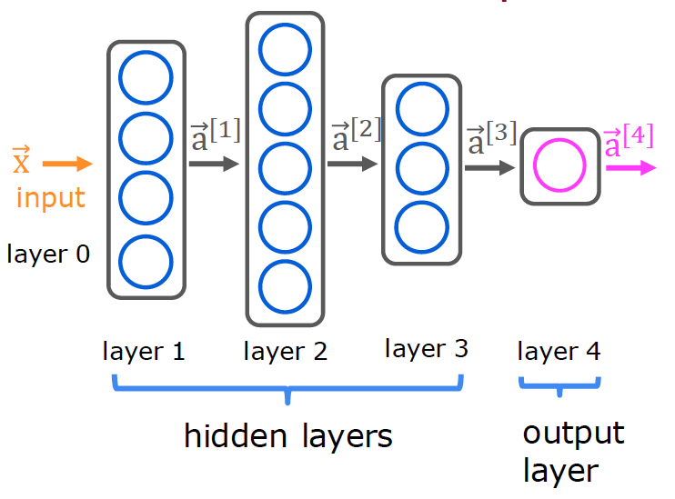
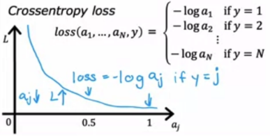
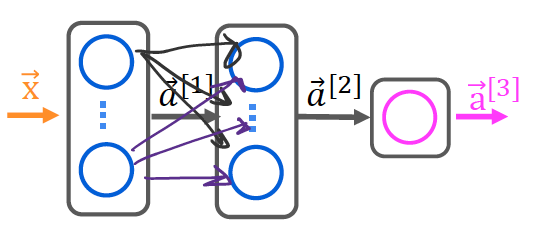
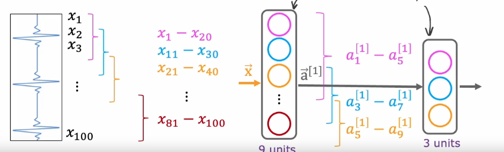

- [Neural Networks](#neural-networks)
  - [Neural Network with Tensorflow](#neural-network-with-tensorflow)
  - [Activation Functions](#activation-functions)
  - [Multiclass Classification](#multiclass-classification)
    - [Softmax Function](#softmax-function)
    - [Cost Function for Multiclass Classification](#cost-function-for-multiclass-classification)
    - [Multiclass Classification with Tensorflow](#multiclass-classification-with-tensorflow)
  - [Multilable Classification](#multilable-classification)
    - [Adam Algorithm](#adam-algorithm)
  - [Layers in a Neural Network](#layers-in-a-neural-network)
    - [Dense Layer](#dense-layer)
    - [Convolutional Layer](#convolutional-layer)

# Neural Networks

- Inference (forward propagation): Predicting the output for new, unseen data. 
- Training (back propagation): Learning the parameters of the model from labeled data. It is called backpropagation.


Neural network with 3 layers (we do not count the input layer), two hidden layers and the output layer. The first hidden layer has 3 neurons the second hidden layer has 4 neurons.

A neuron has inputs $x_1, x_2, …, x_n$ and weights $w_1, w_2, …, w_n$. The output of the neuron is the weighted sum of the inputs passed through an activation function.

$$
z = w_1x_1 + w_2x_2 + \dots + w_nx_n + b
$$

$$
z = \vec{w} \cdot \vec{x} + b
$$

Activation function (usually sigmoid for binary classification, softmax for multiclass classification, ReLU for hidden layers):

$$
\vec{a} = f(z)
$$



The output of the activation function is the input to the next layer.


The activation of the \( j \)-th neuron (unit) in the \( l \)-th layer (dense):

$$
a_j^{(l)} = f\left( \vec{w}_{j}^{(l)} \cdot \vec{a}^{(l-1)} + b_j^{(l)} \right)
$$

e.g. second neuron in the first layer (instead of x we use a(0)):

$$
a_2^{(1)} = f\left( \vec{w}_{2}^{(1)} \cdot \vec{a}^{(0)} + b_2^{(1)} \right)
$$

The number of parameters for a layer:

$$
\text{number of inputs} * \text{number of neurons} + \text{number of biases}
$$

For layer 1 in the example with 5 inputs:
- W1 is (5, 4) = 20 weight parameters
- b1 is (4) bias parameters
- total 24 parameters

For layer 3 in the example:
- W3 is (5, 3) = 15 weight parameters
- b3 is (3) bias parameters
- total 18 parameters

## Neural Network with Tensorflow

Neural network with 2 hidden layer and 1 output layer. Epochs (iterations) are the number of times the model sees the training data.

Binary Crossentropy is the loss function for binary classification also known as logistic loss. It is the same as the log loss function used for logistic regression.

Loss function:

$$
L(f_{\vec{w}b}(\vec{x}^{(i)}), y^{(i)}) = (-y^{(i)} \log\left(f_{\vec{w}b}\left( \vec{x}^{(i)} \right) \right) - \left( 1 - y^{(i)}\right) \log \left( 1 - f_{\vec{w}b}\left( \vec{x}^{(i)} \right) \right)
$$

Cost function:

$$
J(\vec{w}, b) = \frac{1}{m} \sum_{i=1}^{m} \left( L(f_{\vec{w}b}(\vec{x}^{(i)}), y^{(i)}) \right)
$$


```python
import tensorflow as tf
from tensorflow.keras import Sequential
from tensorflow.keras.layers import Dense
from tensorflow.keras.losses import BinaryCrossentropy

# Define the model with 2 hidden layers
model = Sequential([
  Dense(units=25, activation='relu'),
  Dense(units=15, activation='relu'),
  Dense(units=1, activation='sigmoid')
)]

# Compile the model and define the loss function
model.compile(loss=BinaryCrossentropy())

# Train the model with backpropagation
model.fit(X,Y, epochs=100)
```

## Activation Functions

The activation function of a neuron defines when the output of the neuron is activated or not. It introduces non-linearity to the model, allowing it to learn complex patterns in the data. 

If always using linear activation functions, the model would be equivalent to a linear regression model. If all hidden layers have linear activation functions, and the output layer has a sigmoid activation function, the model would be equivalent to logistic regression.

Common activation functions are ReLU for hidden layers and sigmoid for the output layer.


- **Linear**: Output is the same as the input. Used in the output layer for regression problems. Almost the same as no activation function. It can predict any real number. E.g. predict stock prices where the output can be any positive or negative number. 

$$
g(z) = z
$$

- **Sigmoid**: Used in the output layer for binary classification. It squashes the output between 0 and 1.

$$
g(z) = \frac{1}{1 + e^{-z}}
$$

- **ReLU**: Rectified Linear Unit. Used in hidden layers. When the input is negative (off range), the output is zero. It is faster to compute than the sigmoid function. Gradient descent is faster.

$$
g(z) = \max(0, z)
$$

## Multiclass Classification

Y can take more than two possible values. The output layer has one neuron for each class. The activation function is softmax, which squashes the output between 0 and 1 and normalizes the output so that the sum of the outputs is 1.
The output of neuron is the predicted probability for the class.


### Softmax Function

 The softmax function can be written:

$$
a_j = \frac{e^{z_j}}{ \sum_{k=1}^{N}{e^{z_k} }}
$$

- $a_j$: The output of the $j$-th neuron.
- $k$: The index of the output neuron.
- $N$: The number of output neurons.

The output $a$ is a vector of length N, so for softmax regression, you could also write:

```math
a(x) =
\begin{bmatrix}
P(y = 1 | x; w,b) \\
\vdots \\
P(y = N | x; w,b)
\end{bmatrix} 
=
\frac{1}{ \sum_{k=1}^{N}{e^{z_k} }}
\begin{bmatrix}
e^{z_1} \\
\vdots \\
e^{z_{N}}
\end{bmatrix}
```

The output of the neurons z is passed through the softmax function to get the predicted probabilities for each class.

$$
z_1^{[3]} = \vec{w}_1^{[3]} \cdot \vec{a}^{[2]} + b_1^{[3]} 
$$

$$
z_2^{[3]} = \vec{w}_2^{[3]} \cdot \vec{a}^{[2]} + b_2^{[3]} 
$$

...

$$
z_n^{[3]} = \vec{w}_n^{[3]} \cdot \vec{a}^{[2]} + b_n^{[3]} 
$$

Probabilities for class 1:

$$
P(y=1|\vec{x}) = a_1^{[3]}
$$

$$
a_1^{[3]} = \frac{e^{z_1^{[3]}}}{e^{z_1^{[3]}} + ... + e^{z_n^{[3]}}}
$$


Probabilities for class n:

$$
P(y=n|\vec{x}) = a_n^{[3]}
$$

$$
a_n^{[3]} = \frac{e^{z_n^{[3]}}}{e^{z_1^{[3]}} + ... + e^{z_n^{[3]}}}
$$

- the output values sum to one
- the softmax spans all of the outputs. A change in z0 for example will change the values of a0-a3. Compare this to other activations such as ReLU or Sigmoid which have a single input and single output.

### Cost Function for Multiclass Classification

The loss function associated with Softmax, the cross-entropy loss, is:

$$
\begin{equation}
  L(a,y)=\begin{cases}
    -log(a_1), & \text{if $y=1$}.\\
        &\vdots\\
     -log(a_N), & \text{if $y=N$}
  \end{cases}
\end{equation}
$$



The cost function that covers all examples is:

```math
\begin{align}
J(\mathbf{w},b) = -\frac{1}{m} \left[ \sum_{i=1}^{m} \sum_{j=1}^{N}  1\left\{y^{(i)} == j\right\} \log \frac{e^{z^{(i)}_j}}{\sum_{k=1}^N e^{z^{(i)}_k} }\right]
\end{align}
```

Where $m$ is the number of examples, $N$ is the number of outputs. This is the average of all the losses.

Loss for a single example:

$$
loss(a_j) = -y_j \log(a_j)
$$

### Multiclass Classification with Tensorflow

Model outputs the predicted probabilities for each class.

```python
model = Sequential([
  Dense(units=25, activation='relu'),
  Dense(units=15, activation='relu'),
  Dense(units=10, activation='softmax')
])

model.compile(loss=SparseCategoricalCrossEntropy())
model.fit(X,Y,epochs=100)

# Predict the probabilities for each class
probabilities = model(X)
```

A numerical more accourate way is to use a linear output layer and the softmax loss function. The model outputs the z1, z2, z3, ... zn. The probabilities are obtained by passing the logits through the softmax function.

```python
model = Sequential([
  Dense(units=25, activation='relu'),
  Dense(units=15, activation='relu'),
  Dense(units=10, activation='linear') # Model outputs z1, z2, z3, ... zn
])

# Softmax activation function in the loss function
model.compile(loss=SparseCategoricalCrossEntropy(from_logits=True))
model.fit(X,Y,epochs=100)

# the model does not output the probabilities, it outputs z1, z2, z3, ... zn
logits = model(X)

# to get the probabilities, pass the logits through the softmax function
f_x = tf.nn.softmax(logits)
```

## Multilable Classification

Multilabel classification is a classification task where each instance can belong to multiple classes. The output layer has one neuron for each class. The activation function is sigmoid, which squashes the output between 0 and 1.

Different from multiclass classification, where the sum of the probabilities is 1, in multilabel classification, the sum of the probabilities can be greater than 1.


### Adam Algorithm

Adam stands for Adaptive Moment Estimations. It adapts the learning rate during gradient descent. It became a defacto standard for training deep learning models.

```math
w := w - \alpha \frac{\partial}{\partial w} J(w, b) \\
b := b - \alpha \frac{\partial}{\partial b} J(w, b)
```

* If w or b keeps moving in the same direction it increases alpha, meaning it takes larger steps and it is faster. 
* If w or b keeps oscillating, it decreases alpha, meaning it takes smaller steps and it is more stable.

## Layers in a Neural Network

### Dense Layer

Fully connected layer where each neuron is connected to all the neurons in the previous layer.



### Convolutional Layer

Each neuron only looks at a part of the prevous layer output. Often used in image recognition where each neuron looks at a small part of the image. Computations are reduced and is more efficient.


