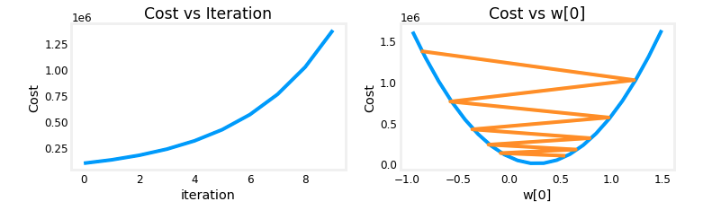
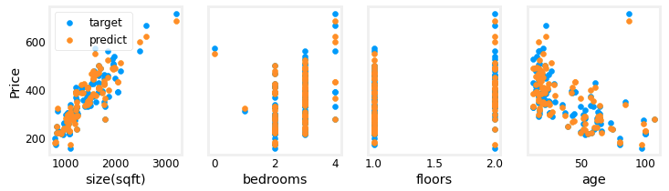
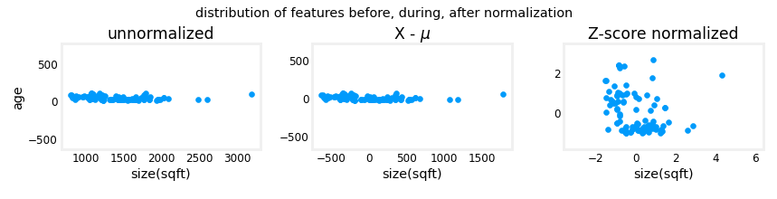

# Machine Learning

- [Machine Learning](#machine-learning)
  - [Overview](#overview)
    - [Supervised Learning](#supervised-learning)
    - [Unsupervised Learning](#unsupervised-learning)
    - [Other Methods](#other-methods)
  - [Linear Regression](#linear-regression)
    - [Model](#model)
    - [Cost Function (Squared Error):](#cost-function-squared-error)
    - [Gradient Descent](#gradient-descent)
    - [Multiple Linear Regression](#multiple-linear-regression)
      - [Vectorization](#vectorization)
      - [Cost Function for Multiple Linear Regression](#cost-function-for-multiple-linear-regression)
      - [Gradient Descent for Multiple Linear Regression](#gradient-descent-for-multiple-linear-regression)
    - [Normal Equation](#normal-equation)
    - [Feature Scaling](#feature-scaling)
      - [Mean Normalization](#mean-normalization)
      - [Z-Score Normalization](#z-score-normalization)
    - [Feature Engineering](#feature-engineering)
    - [Polynomial Regression](#polynomial-regression)


## Overview

### Supervised Learning
- Learns given the right answers
- labeled data x -> y
- regression, classification

### Unsupervised Learning
- Learns without the right answers
- Find structure in data
- clustering, dimensionality reduction, anomaly detection

### Other Methods
 - Reinforcement Learning
 - Recommender Systems

## Linear Regression

### Model
$w$ and $b$ are the parameters of the model. The model is a linear function of the input $x$.

$$
\hat{y} = f_{wb}(x) = wx + b
$$

- **$w$**: The weight or slope of the line, which shows how much $y$ changes for a unit change in $x$.
- **$b$**: The bias or intercept, representing the value of $y$ when $x = 0$
- **$\hat{y}$**: The predicted output or dependent variable.
- **$x$**: The input or independent variable.

### Cost Function (Squared Error):
The cost function $J(w, b)$ measures the average squared difference between the predicted values $\hat{y}$ and the actual values $y$. It is defined as:

$$
J(w, b) = \frac{1}{2m} \sum_{i=1}^{m} \left( f_{wb}(x^{(i)}) - y^{(i)} \right)^2
$$

$$
J(w, b) = \frac{1}{2m} \sum_{i=1}^{m} \left( \hat{y}^{(i)} - y^{(i)} \right)^2
$$

- $m$ is the number of training examples.
- $f_{wb}(x^{(i)})$ is the predicted value of the model for the $i$-th training example.
- $y^{(i)}$ is the actual value for the $i$-th training example.

### Gradient Descent

The goal of training a model is to find the parameters $w$ and $b$ that minimize the cost function $J(w, b)$. 

At each iteration, the parameters $w$ and $b$ are updated using the following rules:

$$
w := w - \alpha \frac{\partial}{\partial w} J(w, b)
$$

$$
b := b - \alpha \frac{\partial}{\partial b} J(w, b)
$$

- $\alpha$ is the learning rate, which controls the size of the steps taken towards the minimum.
- $\frac{\partial}{\partial w} J(w, b)$ is the partial derivative of the cost function with respect to $w$
- $\frac{\partial}{\partial b} J(w, b)$ is the partial derivative of the cost function with respect to $b$

The derivative of the cost function gives the direction of the steepest ascent. As closer to the minimum, the gradient becomes smaller, and the steps taken are smaller. At the minimum, the gradient is zero, and the parameters do not change.

Partial Derivative with Respect to $w$:

$$
\frac{\partial}{\partial w} J(w, b) = \frac{1}{m} \sum_{i=1}^{m} \left( wx^{(i)} + b - y^{(i)} \right) x^{(i)}
$$

Partial Derivative with Respect to $b$:

$$
\frac{\partial}{\partial b} J(w, b) = \frac{1}{m} \sum_{i=1}^{m} \left( wx^{(i)} + b - y^{(i)} \right)
$$

For more details, refer to the [Calculating Partial Derivatives of a Linear Function and the Squared Error Cost Function](./calculus.md#calculating-partial-derivatives-of-a-linear-function-and-the-squared-error-cost-function) section.


Learning Rate
- The learning rate $\alpha$ is a parameter that controls the size of the steps taken during gradient descent. 
- If the learning rate is too small, it will take longer to converge.
- If the learning rate is too large, it may overshoot the minimum and fail to converge.
- The squared error function is convex (only one minimum), so gradient descent will always converge to the global minimum.
- Other cost functions may have multiple local minima. It is not guaranteed that gradient descent will converge to the global minimum. So multiple starting points are used to find the best minimum.

Batch Gradient Descent:
- In batch gradient descent, the parameters are updated after computing the gradient of the cost function for the entire training set.
- Other methods use a subset of the training set to compute the gradient. These methods are called stochastic gradient descent and mini-batch gradient descent.
  
A learning curve can be used to check if gradient descent is working correctly. The cost function should decrease with each iteration and never increase. 


If it increases, the learning rate may be too large.



### Multiple Linear Regression

The model predicts the output based on multiple input features $x_1, x_2, …, x_n$. The parameters $w_1, w_2, …, w_n$ represent the weights for each feature, and $b$ is the bias term.

Model:

$$
\hat{y} = f_{wb}(\vec{x}) = \vec{w} \cdot \vec{x} + b = w_1x_1 + w_2x_2 + \dots + w_nx_n + b
$$

- n: the number of input features.
- $w_1, w_2, …, w_n$: The weights corresponding to each input feature, showing the contribution of each feature to the prediction.
- $b$: The bias or intercept term.
- $\hat{y}$: The predicted output based on all input features (independent variables) $x_1, x_2, …, x_n$.

Weights and features are calculated using the [Dot Product](linear-algebra.md#dot-product)

Housing price prediction with multiple features:



#### Vectorization

Vectorization allows for efficient computation by applying operations to entire arrays. The dot product can be build by CPU and GPU that run in parallel.

```python
# Define the vectors
w = np.array([2, -1, 0.5, 3])
x = np.array([1, 0.5, -2, 4])

# Compute the dot product
dot_product = np.dot(w, x)
```

#### Cost Function for Multiple Linear Regression

The cost function for multiple linear regression is the same as for simple linear regression, but the model predicts the output based on multiple input features.

$$
J(\vec{w}, b) = \frac{1}{2m} \sum_{i=1}^{m} \left( f_{wb}(\vec{x}^{(i)}) - y^{(i)} \right)^2
$$

Vector Notation:

$$
J(\vec{w}, b) = \frac{1}{2m} \left( \vec{X} \vec{w} + b - \vec{y} \right)^T \left( \vec{X} \vec{w} + b - \vec{y} \right)
$$

- $\vec{X}$ is the matrix of input features.
- $\vec{w}$ is the vector of weights.
- $\vec{y}$ is the vector of actual outputs.

#### Gradient Descent for Multiple Linear Regression


$$
\vec{w} := \vec{w} - \alpha \frac{\partial}{\partial \vec{w}} J(\vec{w}, b)
$$

$$
b := b - \alpha \frac{\partial}{\partial b} J(\vec{w}, b)
$$

Partial Derivative with Respect to $\vec{w}$:

$$
\frac{\partial}{\partial w_1} J(\vec{w}, b) = \frac{1}{m} \sum_{i=1}^{m} \left( f_{wb}(\vec{x}^{(i)}) - y^{(i)} \right) x_1^{(i)}
$$

$$
\frac{\partial}{\partial w_2} J(\vec{w}, b) = \frac{1}{m} \sum_{i=1}^{m} \left( f_{wb}(\vec{x}^{(i)}) - y^{(i)} \right) x_2^{(i)}
$$

...

$$
\frac{\partial}{\partial w_n} J(\vec{w}, b) = \frac{1}{m} \sum_{i=1}^{m} \left( f_{wb}(\vec{x}^{(i)}) - y^{(i)} \right) x_n^{(i)}
$$

Can be written in vector notation:

$$
\frac{\partial}{\partial \vec{w}} J(\vec{w}, b) = \frac{1}{m} \vec{X}^T (\vec{X} \vec{w} + b - \vec{y})
$$

Partial Derivative with Respect to b:

$$
\frac{\partial}{\partial b} J(\vec{w}, b) = \frac{1}{m} \sum_{i=1}^{m} \left( f_{wb}(\vec{x}^{(i)}) - y^{(i)} \right)
$$

### Normal Equation

- The normal equation is an analytical solution to linear regression that minimizes the cost function $J(w, b)$, without the need for iterative optimization algorithms like gradient descent.
- Only works for linear regression and not for other models.
- Solve for w and b by setting the partial derivatives of the cost function to zero.
- May be used by some libraries
- Computationally expensive for large datasets

Formula:

$$
\vec{w} = (\vec{X}^T \vec{X})^{-1} \vec{X}^T \vec{y}
$$

$$
b = \frac{1}{m} \sum_{i=1}^{m} \left( y^{(i)} - \vec{w} \cdot \vec{x}^{(i)} \right)
$$

- $\vec{X}$ is the matrix of input features.
- $\vec{w}$ is the vector of weights.
- $\vec{y}$ is the vector of actual outputs.
- $m$ is the number of training examples.

### Feature Scaling

Feature scaling is a preprocessing step that standardizes the range of independent variables. It is important for algorithms that use gradient descent, where the step size needs to be of similar size for all features in order to converge faster.

Aim for a scale where all the features are in range like -1 to 1 or -0.5 to 0.5.

#### Mean Normalization

$$
x_i = \frac{x_i - \mu}{\text{max}(x) - \text{min}(x)}
$$

Example:

Feature $x_1$ No. Bedrooms (0-5) with mean 2.3 and Area $x_2$ (300-2000) with mean 600 have different ranges.

The normalized value of Bedrooms will be in the range:

$$
\text{Bedrooms} = \frac{\text{Bedrooms} - 2.3}{5-0}
$$

$$
-0.46 \leq x_1 \leq 0.54
$$

The normalized value of Area will be in the range:

$$
\text{Area} = \frac{\text{Area} - 1150}{2000-300}
$$

$$
-0.18 \leq x_2 \leq 0.82
$$

#### Z-Score Normalization

$$
x_i = \frac{x_i - \mu}{\sigma}
$$

- $\mu$ is the mean of the feature.
- $\sigma$ is the standard deviation of the feature.

age vs size of house before and after normalization:



### Feature Engineering

Feature engineering is the process of creating new features from existing features. It involves combining and transforming features to make them more informative.

$$
f_{wb}(\vec{x}) = w_1x_1 + w_2x_2 + b
$$

where $x_1$ is the length and $x_2$ is the width of a house. 

A new feature $x_3$ can be created by multiplying the length and width to represent the area of the house.

$$
x_3 = x_1 \times x_2
$$

model with new feature:

$$
f_{wb}(\vec{x}) = w_1x_1 + w_2x_2 + w_3x_3 + b
$$

### Polynomial Regression

Polynomial regression is a form of linear regression in which the relationship between the independent variable $x$ and the dependent variable $y$ is modeled as an $n$-th degree polynomial.

$$
f_{wb}(\vec{x}) = w_1x + w_2x^2 + \dots + w_nx^n + b  
$$

It's important to scale the features. The polynomial terms $x^2, x^3$, which are also new features, need to be in the same range as $x$. Otherwise, the features with higher power e.g. $x^3$ will dominate the cost function.

It's also possible to use a model with a root of x or a logarithm of x.

$$
f_{wb}(\vec{x}) = w_0 + w_1x + w_2\sqrt{x}
$$

This function will be steep at the beginning and then flatten out.