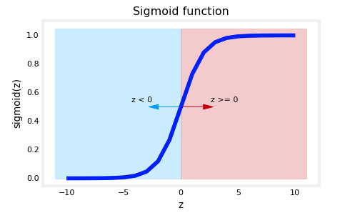

# Machine Learning

- [Machine Learning](#machine-learning)
  - [Linear Regression](#linear-regression)
    - [Model](#model)
    - [Cost Function (Squared Error):](#cost-function-squared-error)
    - [Gradient Descent](#gradient-descent)
    - [Multiple Linear Regression](#multiple-linear-regression)
      - [Vectorization](#vectorization)
      - [Cost Function for Multiple Linear Regression](#cost-function-for-multiple-linear-regression)
      - [Gradient Descent for Multiple Linear Regression](#gradient-descent-for-multiple-linear-regression)
    - [Normal Equation](#normal-equation)
    - [Feature Scaling](#feature-scaling)
      - [Mean Normalization](#mean-normalization)
      - [Z-Score Normalization](#z-score-normalization)
    - [Feature Engineering](#feature-engineering)
    - [Polynomial Regression](#polynomial-regression)
  - [Classification with Logistic Regression](#classification-with-logistic-regression)
    - [Sigmoid Function](#sigmoid-function)
    - [Logistic Regression Model](#logistic-regression-model)
    - [Decision Boundary](#decision-boundary)
    - [Cost Function for Logistic Regression](#cost-function-for-logistic-regression)
    - [Gradient Descent for Logistic Regression](#gradient-descent-for-logistic-regression)
  - [The Problem of Overfitting and Underfitting](#the-problem-of-overfitting-and-underfitting)
    - [Regularization to Reduce Overfitting](#regularization-to-reduce-overfitting)
  - [Neural Networks](#neural-networks)
    - [Neural Network with Tensorflow](#neural-network-with-tensorflow)
    - [Activation Functions](#activation-functions)
    - [Multiclass Classification](#multiclass-classification)
      - [Softmax Function](#softmax-function)
      - [Cost Function for Multiclass Classification](#cost-function-for-multiclass-classification)
      - [Multiclass Classification with Tensorflow](#multiclass-classification-with-tensorflow)
    - [Multilable Classification](#multilable-classification)

## Linear Regression

Supervised learning algorithm that learns from labeled data to predict the output for new, unseen data. It models the relationship between the input and output variables as a linear function. 

### Model
$w$ and $b$ are the parameters of the model. The model is a linear function of the input $x$.

$$
\hat{y} = f_{wb}(x) = wx + b
$$

- **$w$**: The weight or slope of the line, which shows how much $y$ changes for a unit change in $x$.
- **$b$**: The bias or intercept, representing the value of $y$ when $x = 0$
- **$\hat{y}$**: The predicted output or dependent variable.
- **$x$**: The input or independent variable.

### Cost Function (Squared Error):
The cost function $J(w, b)$ measures the average squared difference between the predicted values $\hat{y}$ and the actual values $y$. It is defined as:

$$
J(w, b) = \frac{1}{2m} \sum_{i=1}^{m} \left( f_{wb}(x^{(i)}) - y^{(i)} \right)^2
$$

$$
J(w, b) = \frac{1}{2m} \sum_{i=1}^{m} \left( \hat{y}^{(i)} - y^{(i)} \right)^2
$$

- $m$ is the number of training examples.
- $f_{wb}(x^{(i)})$ is the predicted value of the model for the $i$-th training example.
- $y^{(i)}$ is the actual value for the $i$-th training example.
- Squaring the differences ensures all errors are positive, which avoids negative and positive errors canceling each other out.
- It heavily penalizes larger errors, making the model more sensitive to significant deviations.

### Gradient Descent

The goal of training a model is to find the parameters $w$ and $b$ that minimize the cost function $J(w, b)$. 

At each iteration, the parameters $w$ and $b$ are updated using the following rules:

$$
w := w - \alpha \frac{\partial}{\partial w} J(w, b)
$$

$$
b := b - \alpha \frac{\partial}{\partial b} J(w, b)
$$

- $\alpha$ is the learning rate, which controls the size of the steps taken towards the minimum.
- $\frac{\partial}{\partial w} J(w, b)$ is the partial derivative of the cost function with respect to $w$
- $\frac{\partial}{\partial b} J(w, b)$ is the partial derivative of the cost function with respect to $b$

The derivative of the cost function gives the direction of the steepest ascent. As closer to the minimum, the gradient becomes smaller, and the steps taken are smaller. At the minimum, the gradient is zero, and the parameters do not change.

Partial Derivative with Respect to $w$:

$$
\frac{\partial}{\partial w} J(w, b) = \frac{1}{m} \sum_{i=1}^{m} \left( wx^{(i)} + b - y^{(i)} \right) x^{(i)}
$$

Partial Derivative with Respect to $b$:

$$
\frac{\partial}{\partial b} J(w, b) = \frac{1}{m} \sum_{i=1}^{m} \left( wx^{(i)} + b - y^{(i)} \right)
$$

For more details, refer to the [Calculating Partial Derivatives of a Linear Function and the Squared Error Cost Function](./calculus.md#calculating-partial-derivatives-of-a-linear-function-and-the-squared-error-cost-function) section.


Learning Rate
- The learning rate $\alpha$ is a parameter that controls the size of the steps taken during gradient descent. 
- If the learning rate is too small, it will take longer to converge.
- If the learning rate is too large, it may overshoot the minimum and fail to converge.
- The squared error function is convex (only one minimum), so gradient descent will always converge to the global minimum.
- Other cost functions may have multiple local minima. It is not guaranteed that gradient descent will converge to the global minimum. So multiple starting points are used to find the best minimum.

Batch Gradient Descent:
- In batch gradient descent, the parameters are updated after computing the gradient of the cost function for the entire training set.
- Other methods use a subset of the training set to compute the gradient. These methods are called stochastic gradient descent and mini-batch gradient descent.
  
A learning curve can be used to check if gradient descent is working correctly. The cost function should decrease with each iteration and never increase. 


If it increases, the learning rate may be too large.


### Multiple Linear Regression

The model predicts the output based on multiple input features $x_1, x_2, …, x_n$. The parameters $w_1, w_2, …, w_n$ represent the weights for each feature, and $b$ is the bias term.

Model:

$$
\hat{y} = f_{wb}(\vec{x}) = \vec{w} \cdot \vec{x} + b = w_1x_1 + w_2x_2 + \dots + w_nx_n + b
$$

- n: the number of input features.
- $w_1, w_2, …, w_n$: The weights corresponding to each input feature, showing the contribution of each feature to the prediction.
- $b$: The bias or intercept term.
- $\hat{y}$: The predicted output based on all input features (independent variables) $x_1, x_2, …, x_n$.

Weights and features are calculated using the [Dot Product](linear-algebra.md#dot-product)

Housing price prediction with multiple features:


#### Vectorization

Vectorization allows for efficient computation by applying operations to entire arrays. The dot product can be build by CPU and GPU that run in parallel.

```python
# Define the vectors
w = np.array([2, -1, 0.5, 3])
x = np.array([1, 0.5, -2, 4])

# Compute the dot product
dot_product = np.dot(w, x)
```

#### Cost Function for Multiple Linear Regression

The cost function for multiple linear regression is the same as for simple linear regression, but the model predicts the output based on multiple input features.

$$
J(\vec{w}, b) = \frac{1}{2m} \sum_{i=1}^{m} \left( f_{wb}(\vec{x}^{(i)}) - y^{(i)} \right)^2
$$

Vector Notation:

$$
J(\vec{w}, b) = \frac{1}{2m} \left( \vec{X} \vec{w} + b - \vec{y} \right)^T \left( \vec{X} \vec{w} + b - \vec{y} \right)
$$

- $\vec{X}$ is the matrix of input features.
- $\vec{w}$ is the vector of weights.
- $\vec{y}$ is the vector of actual outputs.

#### Gradient Descent for Multiple Linear Regression


$$
\vec{w} := \vec{w} - \alpha \frac{\partial}{\partial \vec{w}} J(\vec{w}, b)
$$

$$
b := b - \alpha \frac{\partial}{\partial b} J(\vec{w}, b)
$$

Partial Derivative with Respect to $\vec{w}$:

$$
\frac{\partial}{\partial w_1} J(\vec{w}, b) = \frac{1}{m} \sum_{i=1}^{m} \left( f_{wb}(\vec{x}^{(i)}) - y^{(i)} \right) x_1^{(i)}
$$

$$
\frac{\partial}{\partial w_2} J(\vec{w}, b) = \frac{1}{m} \sum_{i=1}^{m} \left( f_{wb}(\vec{x}^{(i)}) - y^{(i)} \right) x_2^{(i)}
$$

...

$$
\frac{\partial}{\partial w_n} J(\vec{w}, b) = \frac{1}{m} \sum_{i=1}^{m} \left( f_{wb}(\vec{x}^{(i)}) - y^{(i)} \right) x_n^{(i)}
$$

Can be written in vector notation:

$$
\frac{\partial}{\partial \vec{w}} J(\vec{w}, b) = \frac{1}{m} \vec{X}^T (\vec{X} \vec{w} + b - \vec{y})
$$

Partial Derivative with Respect to b:

$$
\frac{\partial}{\partial b} J(\vec{w}, b) = \frac{1}{m} \sum_{i=1}^{m} \left( f_{wb}(\vec{x}^{(i)}) - y^{(i)} \right)
$$

### Normal Equation

- The normal equation is an analytical solution to linear regression that minimizes the cost function $J(w, b)$, without the need for iterative optimization algorithms like gradient descent.
- Only works for linear regression and not for other models.
- Solve for w and b by setting the partial derivatives of the cost function to zero.
- May be used by some libraries
- Computationally expensive for large datasets

Formula:

$$
\vec{w} = (\vec{X}^T \vec{X})^{-1} \vec{X}^T \vec{y}
$$

$$
b = \frac{1}{m} \sum_{i=1}^{m} \left( y^{(i)} - \vec{w} \cdot \vec{x}^{(i)} \right)
$$

- $\vec{X}$ is the matrix of input features.
- $\vec{w}$ is the vector of weights.
- $\vec{y}$ is the vector of actual outputs.
- $m$ is the number of training examples.

### Feature Scaling

Feature scaling is a preprocessing step that standardizes the range of independent variables. It is important for algorithms that use gradient descent, where the step size needs to be of similar size for all features in order to converge faster.

Aim for a scale where all the features are in range like -1 to 1 or -0.5 to 0.5.

#### Mean Normalization

$$
x_i = \frac{x_i - \mu}{\text{max}(x) - \text{min}(x)}
$$

Example:

Feature $x_1$ No. Bedrooms (0-5) with mean 2.3 and Area $x_2$ (300-2000) with mean 600 have different ranges.

The normalized value of Bedrooms will be in the range:

$$
\text{Bedrooms} = \frac{\text{Bedrooms} - 2.3}{5-0}
$$

$$
-0.46 \leq x_1 \leq 0.54
$$

The normalized value of Area will be in the range:

$$
\text{Area} = \frac{\text{Area} - 1150}{2000-300}
$$

$$
-0.18 \leq x_2 \leq 0.82
$$

#### Z-Score Normalization

$$
x_i = \frac{x_i - \mu}{\sigma}
$$

- $\mu$ is the mean of the feature.
- $\sigma$ is the standard deviation of the feature.

age vs size of house before and after normalization:


### Feature Engineering

Feature engineering is the process of creating new features from existing features. It involves combining and transforming features to make them more informative.

$$
f_{wb}(\vec{x}) = w_1x_1 + w_2x_2 + b
$$

where $x_1$ is the length and $x_2$ is the width of a house. 

A new feature $x_3$ can be created by multiplying the length and width to represent the area of the house.

$$
x_3 = x_1 \times x_2
$$

model with new feature:

$$
f_{wb}(\vec{x}) = w_1x_1 + w_2x_2 + w_3x_3 + b
$$

### Polynomial Regression

Polynomial regression is a form of linear regression in which the relationship between the independent variable $x$ and the dependent variable $y$ is modeled as an $n$-th degree polynomial.

$$
f_{wb}(\vec{x}) = w_1x + w_2x^2 + \dots + w_nx^n + b  
$$

It's important to scale the features. The polynomial terms $x^2, x^3$, which are also new features, need to be in the same range as $x$. Otherwise, the features with higher power e.g. $x^3$ will dominate the cost function.

It's also possible to use a model with a root of x or a logarithm of x.

$$
f_{wb}(\vec{x}) = w_0 + w_1x + w_2\sqrt{x}
$$

This function will be steep at the beginning and then flatten out.

## Classification with Logistic Regression

Logistic regression is a supervised learning algorithm used for binary classification. It predicts the probability that an instance belongs to a particular class. The predicted probability is then converted into a binary output.

### Sigmoid Function



$$
\sigma(z) = \frac{1}{1 + e^{-z}}
$$

### Logistic Regression Model

the input $z$ to the sigmoid function is the output of a linear regression model:

$$
z = w_1x_1 + w_2x_2 + \dots + w_nx_n + b
$$


The logistic regression model can be represented as:

$$
f_{wb}(\vec{x}) = \sigma(\vec{w} \cdot \vec{x} + b) = \frac{1}{1 + e^{-(\vec{w} \cdot \vec{x} + b)}}
$$

The model predicts the probability that an instance belongs to the positive class. The predicted probability is then converted into a binary output using a threshold value.

$$
\hat{y} = \begin{cases} 1 & \text{if } P(y=1|\vec{x}) \geq 0.5 \\ 0 & \text{otherwise} \end{cases}
$$

For a logistic regression model, $z = \vec{w} \cdot \vec{x} + b$.

- if $\vec{w} \cdot \vec{x} + b \geq 0$, the model predicts $y = 1$
- if $\vec{w} \cdot \vec{x} + b < 0$, the model predicts $y = 0$


### Decision Boundary


Linear decision boundary:

$$
w_1x_1 + w_2x_2 + b = 0
$$

Example:

Given $b = -3$, $w_0 = 1$, and $w_1 = 1$, the model predicts $y = 1$ if $x_1 + x_2 - 3 \geq 0$.


Non-linear decision boundary:

$$
w_1x_1^2 + w_2x_2^2 + b = 0
$$


### Cost Function for Logistic Regression

The squared error cost function used for linear regression is convex. Used with the sigmoid function it because non-convex, leading to multiple local minima. For logistic regression, the cost function is the log loss function, which is convex.

- Loss is a measure of the difference of a single example to its target value while the
- Cost is a measure of the losses over the training set.

Loss function:

$$
L(f_{\mathbf{w},b}(\mathbf{x}^{(i)}), y^{(i)}) = (-y^{(i)} \log\left(f_{\mathbf{w},b}\left( \mathbf{x}^{(i)} \right) \right) - \left( 1 - y^{(i)}\right) \log \left( 1 - f_{\mathbf{w},b}\left( \mathbf{x}^{(i)} \right) \right)
$$

The loss function can be rewritten to be easier to implement.
  
This is a rather formidable-looking equation. It is less daunting when you consider $y^{(i)}$ can have only two values, 0 and 1. One can then consider the equation in two pieces:  

when $y^{(i)} = 0$, the left-hand term is eliminated:

$$
\begin{align}
L(f_{\mathbf{w},b}(\mathbf{x}^{(i)}), 0) &= (-(0) \log\left(f_{\mathbf{w},b}\left( \mathbf{x}^{(i)} \right) \right) - \left( 1 - 0\right) \log \left( 1 - f_{\mathbf{w},b}\left( \mathbf{x}^{(i)} \right) \right) \\
&= -\log \left( 1 - f_{\mathbf{w},b}\left( \mathbf{x}^{(i)} \right) \right)
\end{align}
$$

and when $y^{(i)} = 1$, the right-hand term is eliminated:

$$
\begin{align}
  L(f_{\mathbf{w},b}(\mathbf{x}^{(i)}), 1) &=  (-(1) \log\left(f_{\mathbf{w},b}\left( \mathbf{x}^{(i)} \right) \right) - \left( 1 - 1\right) \log \left( 1 - f_{\mathbf{w},b}\left( \mathbf{x}^{(i)} \right) \right)\\
  &=  -\log\left(f_{\mathbf{w},b}\left( \mathbf{x}^{(i)} \right) \right)
\end{align}
$$

Logistic loss function for a single example $(\mathbf{x}^{(i)}, y^{(i)})$:

$$
  L(f_{\mathbf{w},b}(\mathbf{x}^{(i)}), y^{(i)}) = \begin{cases}
    - \log\left(f_{\mathbf{w},b}\left( \mathbf{x}^{(i)} \right) \right) & \text{if $y^{(i)}=1$}\\
    - \log \left( 1 - f_{\mathbf{w},b}\left( \mathbf{x}^{(i)} \right) \right) & \text{if $y^{(i)}=0$}
  \end{cases}
$$


Cost function for logistic regression:

$$
\hat{y}^{(i)} = f_{wb}(\vec{x}^{(i)}) = \frac{1}{1 + e^{-(\vec{w} \cdot \vec{x}^{(i)} + b)}}
$$


$$
J(\vec{w}, b) = -\frac{1}{m} \sum_{i=1}^{m} \left( y^{(i)} \log(\hat{y}^{(i)}) + (1 - y^{(i)}) \log(1 - \hat{y}^{(i)}) \right)
$$

### Gradient Descent for Logistic Regression

The parameters $w$ and $b$ are updated simultaneous using the following rules:

$$
\vec{w} := \vec{w} - \alpha \frac{\partial}{\partial \vec{w}} J(\vec{w}, b)
$$

$$
b := b - \alpha \frac{\partial}{\partial b} J(\vec{w}, b)
$$

Partial Derivative with Respect to $\vec{w}$:

$$
\frac{\partial}{\partial w_j} J(\vec{w}, b) = \frac{1}{m} \sum_{i=1}^{m} \left( f_{wb}(\vec{x}^{(i)}) - y^{(i)} \right) x_j^{(i)}
$$

$$
\frac{\partial}{\partial \vec{w}} J(\vec{w}, b) = \frac{1}{m} \vec{X}^T (\vec{X} \vec{w} + b - \vec{y})
$$

Partial Derivative with Respect to $\vec{b}$:

$$
\frac{\partial}{\partial b} J(\vec{w}, b) = \frac{1}{m} \sum_{i=1}^{m} \left( f_{wb}(\vec{x}^{(i)}) - y^{(i)} \right)
$$

The partial derivatives are the same as for linear regression, but the model predicts the output using the sigmoid function.

## The Problem of Overfitting and Underfitting

- A model with high bias does not fit the training set well. It is called underfitting.
- If it has a high variance, it fits the training set too well and does not generalize to new data. It is called overfitting.

Regression 

Classification 

### Regularization to Reduce Overfitting

- Collect more training data is the best solution.
- Select only the most important features based on intuition or domain knowledge.
- Reduce the weight of the less important features.

Regularization adds a penalty term to the cost function to reduce the complexity of the model. It discourages the weights from becoming too large, which can lead to overfitting.

L2 Regularization (Ridge)

$$
J(\vec{w}, b) = \frac{1}{2m} \sum_{i=1}^{m} \left( f_{\vec{w}b}(\vec{x}^{(i)}) - y^{(i)} \right)^2 + \frac{\lambda}{2m} \sum_{j=1}^{n} w_j^2
$$

- $\lambda$ is the regularization parameter that controls the strength of the regularization.
- if lambda is zero, the regularization term has no effect.
- the parameter $b$ is not regularized but can be included in the regularization term as well.
- higher order features usually have larger weights, those features typically end up being more penalized by the regularization term.

Gradient Descent with L2 Regularization:

$$
\vec{w} := \vec{w} - \alpha \left( \frac{1}{m} \sum_{i=1}^{m} \left( f_{\vec{w}b}(\vec{x}^{(i)}) - y^{(i)} \right) \vec{x}^{(i)} + \frac{\lambda}{m} \vec{w} \right)
$$


The cost function (red line) increases the overall cost for large values of $w$.

## Neural Networks

- Inference (forward propagation): Predicting the output for new, unseen data. 
- Training (back propagation): Learning the parameters of the model from labeled data. It is called backpropagation.


Neural network with 3 layers (we do not count the input layer), two hidden layers and the output layer. The first hidden layer has 3 neurons the second hidden layer has 4 neurons.

A neuron has inputs $x_1, x_2, …, x_n$ and weights $w_1, w_2, …, w_n$. The output of the neuron is the weighted sum of the inputs passed through an activation function.

$$
z = w_1x_1 + w_2x_2 + \dots + w_nx_n + b
$$

$$
z = \vec{w} \cdot \vec{x} + b
$$

Activation function (usually sigmoid for binary classification, softmax for multiclass classification, ReLU for hidden layers):

$$
\vec{a} = f(z)
$$


The output of the activation function is the input to the next layer.


The activation of the \( j \)-th neuron (unit) in the \( l \)-th layer (dense):

$$
a_j^{(l)} = f\left( \vec{w}_{j}^{(l)} \cdot \vec{a}^{(l-1)} + b_j^{(l)} \right)
$$

e.g. second neuron in the first layer (instead of x we use a(0)):

$$
a_2^{(1)} = f\left( \vec{w}_{2}^{(1)} \cdot \vec{a}^{(0)} + b_2^{(1)} \right)
$$

The number of parameters for a layer:

$$
\text{number of inputs} * \text{number of neurons} + \text{number of biases}
$$

### Neural Network with Tensorflow

Neural network with 2 hidden layer and 1 output layer. Epochs (iterations) are the number of times the model sees the training data.

Binary Crossentropy is the loss function for binary classification also known as logistic loss. It is the same as the log loss function used for logistic regression.

Loss function:

$$
L(f_{\vec{w}b}(\vec{x}^{(i)}), y^{(i)}) = (-y^{(i)} \log\left(f_{\vec{w}b}\left( \vec{x}^{(i)} \right) \right) - \left( 1 - y^{(i)}\right) \log \left( 1 - f_{\vec{w}b}\left( \vec{x}^{(i)} \right) \right)
$$

Cost function:

$$
J(\vec{w}, b) = \frac{1}{m} \sum_{i=1}^{m} \left( L(f_{\vec{w}b}(\vec{x}^{(i)}), y^{(i)}) \right)
$$


```python
import tensorflow as tf
from tensorflow.keras import Sequential
from tensorflow.keras.layers import Dense
from tensorflow.keras.losses import BinaryCrossentropy

# Define the model with 2 hidden layers
model = Sequential([
  Dense(units=25, activation='relu'),
  Dense(units=15, activation='relu'),
  Dense(units=1, activation='sigmoid')
)]

# Compile the model and define the loss function
model.compile(loss=BinaryCrossentropy())

# Train the model with backpropagation
model.fit(X,Y, epochs=100)
```

### Activation Functions

The activation function of a neuron defines when the output of the neuron is activated or not. It introduces non-linearity to the model, allowing it to learn complex patterns in the data. 

If always using linear activation functions, the model would be equivalent to a linear regression model. If all hidden layers have linear activation functions, and the output layer has a sigmoid activation function, the model would be equivalent to logistic regression.

Common activation functions are ReLU for hidden layers and sigmoid for the output layer.


- **Linear**: Output is the same as the input. Used in the output layer for regression problems. Almost the same as no activation function. It can predict any real number. E.g. predict stock prices where the output can be any positive or negative number. 

$$
g(z) = z
$$

- **Sigmoid**: Used in the output layer for binary classification. It squashes the output between 0 and 1.

$$
g(z) = \frac{1}{1 + e^{-z}}
$$

- **ReLU**: Rectified Linear Unit. Used in hidden layers. When the input is negative (off range), the output is zero. It is faster to compute than the sigmoid function. Gradient descent is faster.

$$
g(z) = \max(0, z)
$$

### Multiclass Classification

Y can take more than two possible values. The output layer has one neuron for each class. The activation function is softmax, which squashes the output between 0 and 1 and normalizes the output so that the sum of the outputs is 1.


#### Softmax Function

 The softmax function can be written:

$$
a_j = \frac{e^{z_j}}{ \sum_{k=1}^{N}{e^{z_k} }}
$$

- $a_j$: The output of the $j$-th neuron.
- $k$: The index of the output neuron.
- $N$: The number of output neurons.

The output $a$ is a vector of length N, so for softmax regression, you could also write:

<!-- $$
a(x) =
\begin{pmatrix}
P(y = 1 | x; w,b) \\
\vdots \\
P(y = N | x; w,b)
\end{pmatrix} 
=
\frac{1}{ \sum_{k=1}^{N}{e^{z_k} }}
\begin{pmatrix}
e^{z_1} \\
\vdots \\
e^{z_{N}}
\end{pmatrix}
$$ -->

The output of the neurons z is passed through the softmax function to get the predicted probabilities for each class.

$$
z_1^{[3]} = \vec{w}_1^{[3]} \cdot \vec{a}^{[2]} + b_1^{[3]} 
$$

$$
z_2^{[3]} = \vec{w}_2^{[3]} \cdot \vec{a}^{[2]} + b_2^{[3]} 
$$

...

$$
z_n^{[3]} = \vec{w}_n^{[3]} \cdot \vec{a}^{[2]} + b_n^{[3]} 
$$

Probabilities for class 1:

$$
P(y=1|\vec{x}) = a_1^{[3]}
$$

$$
a_1^{[3]} = \frac{e^{z_1^{[3]}}}{e^{z_1^{[3]}} + ... + e^{z_n^{[3]}}}
$$


Probabilities for class n:

$$
P(y=n|\vec{x}) = a_n^{[3]}
$$

$$
a_n^{[3]} = \frac{e^{z_n^{[3]}}}{e^{z_1^{[3]}} + ... + e^{z_n^{[3]}}}
$$

- the output values sum to one
- the softmax spans all of the outputs. A change in z0 for example will change the values of a0-a3. Compare this to other activations such as ReLU or Sigmoid which have a single input and single output.

#### Cost Function for Multiclass Classification

The loss function associated with Softmax, the cross-entropy loss, is:

$$
\begin{equation}
  L(a,y)=\begin{cases}
    -log(a_1), & \text{if $y=1$}.\\
        &\vdots\\
     -log(a_N), & \text{if $y=N$}
  \end{cases}
\end{equation}
$$

The cost function that covers all examples is:

$$
\begin{align}
J(\mathbf{w},b) = -\frac{1}{m} \left[ \sum_{i=1}^{m} \sum_{j=1}^{N}  1\left\{y^{(i)} == j\right\} \log \frac{e^{z^{(i)}_j}}{\sum_{k=1}^N e^{z^{(i)}_k} }\right]
\end{align}
$$

Where $m$ is the number of examples, $N$ is the number of outputs. This is the average of all the losses.

Loss for a single example:

$$
loss(a_j) = -y_j \log(a_j)
$$

#### Multiclass Classification with Tensorflow

Model outputs the predicted probabilities for each class.

```python
model = Sequential([
  Dense(units=25, activation='relu')
  Dense(units=15, activation='relu')
  Dense(units=10, activation='softmax')
])

model.compile(loss=SparseCategoricalCrossEntropy())
model.fit(X,Y,epochs=100)

# Predict the probabilities for each class
probabilities = model(X)
```

A numerical more accourate way is to use a linear output layer and the softmax loss function. The model outputs the z1, z2, z3, ... zn. The probabilities are obtained by passing the logits through the softmax function.

```python
model = Sequential([
  Dense(units=25, activation='relu')
  Dense(units=15, activation='relu')
  Dense(units=10, activation='linear') # Model outputs z1, z2, z3, ... zn
])

# Softmax activation function in the loss function
model.compile(loss=SparseCategoricalCrossEntropy(from_logits=True))
model.fit(X,Y,epochs=100)

# the model does not output the probabilities, it outputs z1, z2, z3, ... zn
logits = model(X)

# to get the probabilities, pass the logits through the softmax function
f_x = tf.nn.softmax(logits)
```

### Multilable Classification

Multilabel classification is a classification task where each instance can belong to multiple classes. The output layer has one neuron for each class. The activation function is sigmoid, which squashes the output between 0 and 1.

Different from multiclass classification, where the sum of the probabilities is 1, in multilabel classification, the sum of the probabilities can be greater than 1.


