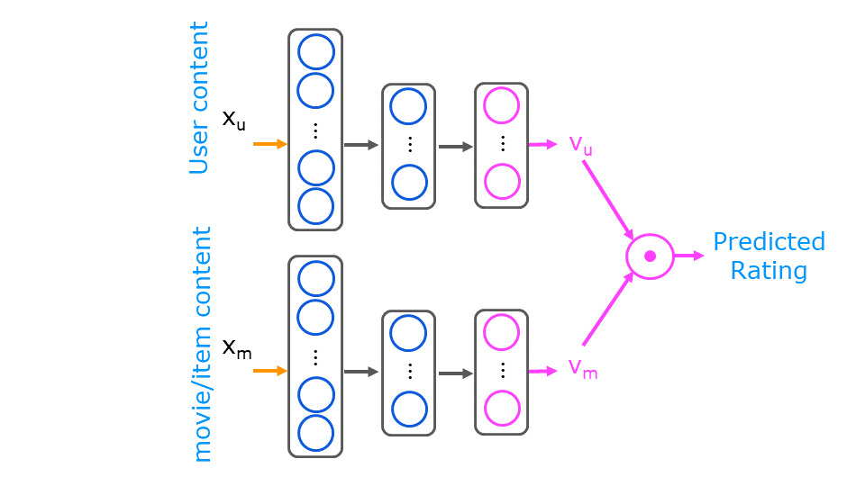

- [Recommender Systems](#recommender-systems)
  - [Collaborative Filtering](#collaborative-filtering)
    - [Collaborative Filtering Algorithm](#collaborative-filtering-algorithm)
    - [Binary Labels](#binary-labels)
    - [Mean Normalization](#mean-normalization)
    - [Finding Similar Items](#finding-similar-items)
    - [Collaborative Filtering in Tensorflow](#collaborative-filtering-in-tensorflow)
    - [Limitations of Collaborative Filtering](#limitations-of-collaborative-filtering)
  - [Content-Based Filtering](#content-based-filtering)
    - [Retrival and Ranking](#retrival-and-ranking)

# Recommender Systems
Recommender systems are used to recommend items to users based on their preferences. They are used in e-commerce, social media, and streaming services.

## Collaborative Filtering
If we have ratings from multiple users and features for the items, we can use supervised learning algorithms (linear regression) to predict the rating of a user for an item.
All users collaborate to generate the rating set.

| Movie                  | Alice(1) | Bob(2) | Carol(3) | Dave(4) | x1 (romance) | x2 (action) |
|------------------------|----------|--------|----------|---------|--------------|-------------|
| Love at last           | 5        | 5      | 0        | 0       | 0.9          | 0           |
| Romance forever        | 5        | ?      | 0        | 0       | 1.0          | 0.01        |
| Cute puppies of love   | ?        | 4      | ?        | ?       | 0.99         | 0           |
| Nonstop car chases     | 0        | 0      | 4        | 4       | 0.1          | 1.0         |
| Swords vs. karate      | 0        | 0      | ?        | ?       | 0            | 0.9         |

- $n_u$ is the number of users
- $n_m$ is the number of movies
- $r(i, j) = 1$ if user $j$ has rated movie $i$. e.g. $r(1, 1) = 1$ and $r(2, 2) = 0$
- $y(i, j)$ is the rating given by user $j$ to movie $i$. e.g. $y(1, 1) = 5$ and $y(2, 4) = 0$
- $x^{(i)}$ is the feature vector for movie $i$, e.g. $x^{(1)} = \begin{bmatrix} 0.9 \\ 0 \end{bmatrix}$
- $m_j$ is the number of movies rated by user $j$

Predict the rating for moive Cute puppies of love for user Alice. Parameters $w$ and $b$ are learned from the data. $x$ is the feature vector for the movie. 
$w$ represents the taste of a user and has the same length as $x$.
```math
\text{rating} = w^{(1)} * x^{(3)} + b^{(1)} = \begin{bmatrix} 5 \\ 0 \end{bmatrix} * \begin{bmatrix} 0.99 \\ 0 \end{bmatrix} + 0 = 4.95
```

To learn the parameters $w^{(j)}$ and $b^{(j)}$ for a user $j$ we minimize the cost function:
```math
J(w^{(j)}, b^{(j)}) = \frac{1}{2} \sum_{i:r(i, j) = 1} \left( w^{(j)} * x^{(i)} + b^{(j)} - y^{(i, j)} \right)^2 + \frac{\lambda}{2} \sum_{k=1}^{n} (w_k^{(j)})^2 
```

- $y^{(i, j)}$ is the rating by user $j$ on movie $i$. We exculde the movies that have not been rated from the sum. $r(i, j) = 1$ if user $j$ has rated movie $i$.
- $\lambda$ is the regularization parameter
- $n$ is the number of features, e.g. $n = 2$ in the example

To learn all the parameters $w^{(j)}$ and $b^{(j)}$ for all users we minimize the cost function:
```math
J(w^{(1)}, b^{(1)}, \ldots, w^{(n_u)}, b^{(n_u)}) = \frac{1}{2} \sum_{j=1}^{n_u} \sum_{i:r(i, j) = 1} \left( w^{(j)} * x^{(i)} + b^{(j)} - y^{(i, j)} \right)^2 + \frac{\lambda}{2} \sum_{j=1}^{n_u} \sum_{k=1}^{n} (w_k^{(j)})^2 
```

- the vector $w^{(j)}$ is the parameter vector for user $j$ and has the same length as the feature vector $x^{(i)}$
- Each has one bias term $b^{(j)}$
- Parameters per user: $n + 1$. Toatal parameters for $n_u$ user and $n$ features: $n_u * (n + 1)$

### Collaborative Filtering Algorithm

In the example above we used the features of the movies to predict the ratings of the users. 
In collaborative filtering we use the ratings of the users to learn the features of the movies if we don't have the features.

| Movie                  | Alice(1) | Bob(2) | Carol(3) | Dave(4) | x1 (romance) | x2 (action) |
|------------------------|----------|--------|----------|---------|--------------|-------------|
| Love at last           | 5        | 5      | 0        | 0       | ?            | ?           |
| Romance forever        | 5        | ?      | 0        | 0       | ?            | ?           |
| Cute puppies of love   | ?        | 4      | ?        | ?       | ?            | ?           |
| Nonstop car chases     | 0        | 0      | 4        | 4       | ?            | ?           |
| Swords vs. karate      | 0        | 0      | ?        | ?       | ?            | ?           |

Given $w^{(1)}, b^{(1)}, \ldots, w^{(n_u)}, b^{(n_u)}$ we can learn the features $x$ for the movies. We can then use the features to predict the ratings of the users.

To learn $x$ for a movie $i$ we minimize the cost function:
```math
J(x^{(i)}) = \frac{1}{2} \sum_{j:r(i, j) = 1} \left( w^{(j)} * x^{(i)} + b^{(j)} - y^{(i, j)} \right)^2 + \frac{\lambda}{2} \sum_{k=1}^{n} (x_k^{(i)})^2 
```

For all movies we minimize the cost function:
```math
J(x^{(1)}, \ldots, x^{(n_m)}) = \frac{1}{2} \sum_{i=1}^{n_m} \sum_{j:r(i, j) = 1} \left( w^{(j)} * x^{(i)} + b^{(j)} - y^{(i, j)} \right)^2 + \frac{\lambda}{2} \sum_{i=1}^{n_m} \sum_{k=1}^{n} (x_k^{(i)})^2 
```

- $n_m$ is the number of movies
- $n$ is the number of features, e.g. $n = 2$ in the example
- $y^{(i, j)}$ is the rating by user $j$ on movie $i$. We exculde the movies that have not been rated from the sum. $r(i, j) = 1$ if user $j$ has rated movie $i$.

We can combine the cost function to learn the parameters $w$, $b$ and the cost function to learn the features $x$ and minimize the cost function for all parameters:

```math
J(w, b, x) = \frac{1}{2} \sum_{(i, j):r(i, j) = 1} \left( w^{(j)} * x^{(i)} + b^{(j)} - y^{(i, j)} \right)^2 + \frac{\lambda}{2} \sum_{j=1}^{n_u} \sum_{k=1}^{n} (w_k^{(j)})^2 + \frac{\lambda}{2} \sum_{i=1}^{n_m} \sum_{k=1}^{n} (x_k^{(i)})^2 
```

We can use gradient descent or other optimization algorithms to minimize the cost.
```math
w_j^{(j)} := w_j^{(j)} - \alpha \frac{\partial}{\partial w_j^{(j)}} J(w, b, x)
```
```math
b^{(j)} := b^{(j)} - \alpha \frac{\partial}{\partial b^{(j)}} J(w, b, x)
```
```math
x_k^{(i)} := x_k^{(i)} - \alpha \frac{\partial}{\partial x_k^{(i)}} J(w, b, x)
```

### Binary Labels

If we don't have ratings like 1 to 5, but have the information if a user likes a movie or not, we have so called binary labels.
The labels are 1 if the user likes the movie and 0 if the user does not like the movie.
Other examples are: click/no click, buy/no buy. 

For binary labels the predict is similar to logistic regression:
```math
g(z) = \frac{1}{1 + e^{-z}}
```
```math
y^{(i, j)}: f_{(w,b,x)}(x) = g(w^{j} * x^{(i)} + b^{(j)})
```
The loss for a single example is:
```math
L(f_{(w,b,x)}(x), y^{(i, j)}) = -y^{(i, j)} \log(f_{(w,b,x)}(x) - (1 - y^{(i, j)}) \log(1 - f_{(w,b,x)}(x)
```
The cost function is the sum of the loss for all examples:
```math
J(w, b, x) = \frac{1}{m} \sum_{i=1}^{m} L(f_{(w,b,x)}(x), y^{(i, j)}) + \frac{\lambda}{2} \sum_{j=1}^{n_u} \sum_{k=1}^{n} (w_k^{(j)})^2 + \frac{\lambda}{2} \sum_{i=1}^{n_m} \sum_{k=1}^{n} (x_k^{(i)})^2 
```

- $m$ is the number of examples
- $n_u$ is the number of users
- $n_m$ is the number of movies
- $n$ is the number of features
- $y^{(i, j)}$ is the label for the example $i$ and user $j$. $y^{(i, j)} = 1$ if the user likes the movie and $y^{(i, j)} = 0$ if the user does not like the movie.
- $f_{(w,b,x)}(x)$ is the prediction of the model
- $x$ is the feature vector for the movie

### Mean Normalization

Mean normalization is used to normalize the ratings of the users. The mean of the ratings is subtracted from the ratings.
```math
y^{(i, j)} = y^{(i, j)} - \mu
```

If we have a user that has not rated any movies, the prediction for the user will be the mean of all the ratings.

Example:

Given 5 users $n$ and 5 movies $m$, where user 5 has not rated any movies:
```math
\begin{bmatrix}
5 & 5 & 0 & 0 & ? \\
5 & ? & ? & 0 & ? \\
? & 4 & 0 & ? & ? \\
0 & 0 & 5 & 4 & ? \\
0 & 0 & 5 & 0 & ?
\end{bmatrix}
```
The mean of the ratings for each movie is:
```math
\begin{bmatrix}
2.5 \\
2.5 \\
2 \\
2.25 \\
1.25 
\end{bmatrix}
```

then we subtract the mean from the ratings to get the normalized ratings:
```math
\begin{bmatrix}
2.5 & 2.5 & -2.5 & -2.5 & ? \\
2.5 & ? & ? & -2.5 & ? \\
? & 2 & -2 & ? & ? \\
-2.25 & -2.25 & 2.75 & 1.75 & ? \\
-1.25 & -1.25 & 3.75 & -1.25 & ?
\end{bmatrix}
```

The we can learn the ratings like in the previous examples. For users that have not rated any movies, the prediction will be the mean of the ratings.
We just need to add the mean to the prediction to get the actual rating.
```math
w^{(5)} * x^{(i)} + b^{(5)} + \mu_i
```

### Finding Similar Items

Lets say user selects a movie $i$ and we want to recommend a similar movie $k$. 
We can use the features $x$ to find the similarity between the movies by calculating the distance between the feature vectors with the Euclidean distance.

```math
\text{similarity} = \sum_{j=1}^{n} (x_j^{(i)} - x_j^{(k)})^2 = ||x^{(i)} - x^{(k)}||^2
```

### Collaborative Filtering in Tensorflow

Neural networks are not typically used for collaborative filtering. But we can user TensorFlow auto differentiation to learn the parameters $w$, $b$ and $x$.

Example for gradient descent:

```python
w = tf.Variable(3.0)
x = 1.0
y = 1.0 # target value
alpha = 0.01
iterations = 30

for iter in range(iterations):
  # Use TensorFlow’s Gradient tape to record the steps
  # used to compute the cost J, to enable auto differentiation.
  with tf.GradientTape() as tape:
    fwb = w*x
    costJ = (fwb - y)**2
  
  # Use the gradient tape to calculate the gradients
  # of the cost with respect to the parameter w.
  [dJdw] = tape.gradient( costJ, [w] )
  
  # Run one step of gradient descent by updating
  # the value of w to reduce the
  w.assign_add(-alpha * dJdw)
```

Example for Adam optimizer:

```python
# Instantiate an optimizer.
optimizer = keras.optimizers.Adam(learning_rate=1e-1)
iterations = 200

for iter in range(iterations):
  # Use TensorFlow’s GradientTape
  # to record the operations used to compute the cost
  with tf.GradientTape() as tape:
    # Compute the cost (forward pass is included in cost)
    cost_value = cofiCostFuncV(X, W, b, Ynorm, R, num_users, num_movies, lambda)
  
  # Use the gradient tape to automatically retrieve
  # the gradients of the trainable variables with respect to the loss
  grads = tape.gradient( cost_value, [X,W,b] )
  
  # Run one step of gradient descent by updating
  # the value of the variables to minimize the loss.
  optimizer.apply_gradients( zip(grads, [X,W,b]) )
```

### Limitations of Collaborative Filtering

- Cold start problem: If a new user or movie is added, we don't have any ratings for the user or movie. We can't make any recommendations.
- Show something reasonable to new users who have rated few items.
- Meta informations such as genres, actors, directors, etc. or information about the user like age or country are not used in collaborative filtering.


## Content-Based Filtering

Collaborative filterind:
- Recommend items based on rating of users who gave similar ratings as you.

Content-based filtering:
- Recommend items based on the features of user and items (content).

User features:
- age
- gender
- country
- movies watched
- average rating per genere

Movie features:
- genere
- year
- actors
- reviews

Notation:
- $r(i, j)$ = 1 if user j has rated movie i
- $y(i, j)$ = rating by user j on movie i
- $x_u^{(j)}$ = feature vector for user j
- $x_m^{(i)}$ = feature vector for movie i

$x_u^{(j)}$ and $x_m^{(i)}$ are vectors with difference lengths. 
To predict the rating of user j on movie i we can use the dot product of the vectors $v_u^{(j)}$ and $v_m^{(i)}$:
These vectors have the same length and are computed from the features $x_u^{(j)}$ and $x_m^{(i)}$.

```math
\text{prediction} = v_u^{(j)} \cdot v_m^{(i)}
```

To predict the probability of user $j$ liking movie $i$ we can use the sigmoid function.
```math
p = g(v_u^{(j)} \cdot v_m^{(i)})
```
```math
p = \frac{1}{1 + e^{-v_u^{(j)} \cdot v_m^{(i)}}}
```

We can use a neural network to learn the vector $v_u^{(j)}$  that describes the user $j$ 
and a neural network to learn the vector $v_m^{(i)}$ that describes the movie $i$.
The two networks can have different architectures, but the ouput layer needs to have the same length.



The parameters of the networks are trained together to minimize the cost function. 
Same as collaborative we only use the examples where the user has rated the movie $r(i, j) = 1$.
```math
J(v_u^{(1)}, \ldots, v_u^{(n_u)}, v_m^{(1)}, \ldots, v_m^{(n_m)}) = \frac{1}{2} \sum_{(i, j):r(i, j) = 1} \left( v_u^{(j)} \cdot v_m^{(i)} - y^{(i, j)} \right)^2 + \frac{\lambda}{2} \sum_{j=1}^{n_u} \sum_{k=1}^{n} (v_k^{(j)})^2 + \frac{\lambda}{2} \sum_{i=1}^{n_m} \sum_{k=1}^{n} (v_k^{(i)})^2 
```

To finde similar movies we can use the euclidean distance between the vectors $v_m^{(i)}$ and $v_m^{(k)}$.
```math
\text{similarity} = ||v_m^{(i)} - v_m^{(k)}||^2
```

### Retrival and Ranking

To efficiently recommend items to a user, it is not necesary to compute the ranking for all items when the user logs in.
The vector $v_m^{(i)}$ for all movies can be precomputed and stored in a database.

Retrival:
 1.  For each of the last 10 movies watched by the user, find 10 most similar movies: $||v_m^{(j)} - v_m^{(k)}||^2$
 2.  For most viewed 3 genres, find the top 10 movies
 3.  Top 20 movies in the country
 4.  Combine retrieved items into list, removing duplicates and items already watched/purchased

Ranking:
1. Take list of movies retrieved and rank using the trained model: $v_u^{(j)} \cdot v_m^{(i)}$
