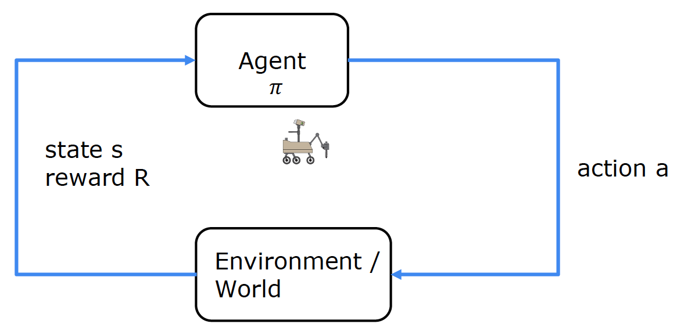

# Reinforcement Learning

- [Reinforcement Learning](#reinforcement-learning)
  - [Markov Decision Process](#markov-decision-process)
  - [State Action Value Function](#state-action-value-function)
  - [Deep Reinforcement Learning](#deep-reinforcement-learning)


Reinforcement learning is used to teach a software agent  how to make decisions. The goal is to learn a policy that maps states to actions that maximizes the reward.

- $s_g$ is the current state
- $a_g$ is the current action
- $R(s)_g$ is the reward for state $s$
- $s'$ is the next state
- $a'$ the action in the next state
- $\gamma$ is the discount factor (0 to 1) usually 0.9 or close to 1

The return $G_t$ is the sum of the rewards from time $t$ to the end of the episode.
```math
G_t = R_{t+1} + \gamma R_{t+2} + \gamma^2 R_{t+3} + \ldots = \sum_{k=0}^{\infty} \gamma^k R_{t+k+1}
```
The return depends on the rewards you get and the reward depends on the actions you take.
The discount factor $\gamma$ is used to give more weight to immediate rewards.

The policy $\pi$ is a function used to select actions. It mapps from states to actions.
```math
\pi(a|s) = P(a|s)
```

- $P(a|s)$ is the probability of taking action $a$ in state $s$
- $\pi(a|s)$ is the policy that selects the action $a$ in state $s$

## Markov Decision Process

In a markov decision process (MDP) the future is only determined by the current state ant not how you got in this state.



Concepts:

- **State:** The current situation
  - position of a robot
- **Action:** The decision made by the agent
  - move left, move right
- **Reward:** The feedback from the environment
- **discount factor:** The importance of future rewards
- **return:** The sum of the rewards
- **policy:** The strategy used to select actions
  - position is the inupt, the output is the action to take

## State Action Value Function

The state action value function $Q(s, a)$ is the expected return starting from state $s$, taking action $a$ and following policy $\pi$.

At every state pick the action that maximizes the state action value function. 

The best possible return from state $s$ is the maximum of the state action value function over all actions.

```math
max_a Q(s, a)
```

Example:

$Q(s, a)$ = Return if you
- start in state $s$
- take action $a$ once
- then behave optimally after that


State 1 has a reward of 100 and state 6 has a reward of 40, all other states have a reward of 0. Starting at state 5, the best action is to move to the right. For states 2 - 4 the best action is to move to the left.


**Bellman Equation**

$Q(s, a)$ is the expected return form the reward of the current state $s$ and the max of all possible actions in the next state $s'$ multiplied by the discount factor $\gamma$.

```math
Q(s, a) = R(s) + \gamma * max_{a'} Q(s', a')
```

Expected return in stochastic environment:
```math
Q(s, a) = E(R_1 + \gamma R_2 + \gamma^2 R_3 + \ldots)
```
```math
Q(s, a) = R(s) + \gamma * E(max_{a'} Q(s', a'))
```

## Deep Reinforcement Learning

If both the state and action are discret values, we can estimate the action-value function iteratively. However, if the state and action space are continuous, we can use a neural network to estimate the action-value function.

The input to the neural network is the state $s$ and the action $a$. The ouput is the state action value function $Q(s, a)$ or $y$.

```math
\vec{x} = \begin{bmatrix} s \\ a \end{bmatrix} \Rightarrow \text{neuronal network} \Rightarrow  Q(s, a) = y
```

To train the network we need to create a training set and then train the network with supervised learning.
To create the training set we can use the Bellman equation.

Learing Algorithm:

- Initialize the neural network with randomly as guess of $Q(s, a)$
- Repeate:
  - Take actions in the environment. Get $(s, a, R(s), s')$
  - Store 10000 most recent tuples $(s, a, R(s), s')$ in replay memory
  - Train neural network:
    - Create training set of 10000 examples $x = (s, a)$ and $y = R(s) + \gamma * max_{a'} Q(s', a')$
    - Train $Q_{new}$ such that $Q_{new}(s, a) \approx y$
  - Set Q = $Q_{new}$

At the end the inital random guess of $Q(s, a)$ will be replaced by the optimal $Q(s, a)$.
If we repeat this, we and up with a better and better $Q(s, a)$.

**Soft update:**

Instead of setting $Q = Q_{new}$ we can use a soft update where we update $Q$ with a small fraction of $Q_{new}$. This way we can avoid oscillations.

```math
Q(s, a) = (1 - \tau) Q(s, a) + \tau Q_{new}(s, a)
```
- $\tau$ is the update rate e.g. 0.01

**Greedy policy:**

If we always pick the optimal action, we might miss some states and never explore some paths. To avoid this we can use the $\epsilon$-greedy policy that selects a random action with probability $\epsilon$ and the optimal action with probability $1 - \epsilon$.

```math
\pi(a|s) = \begin{cases}
1 - \epsilon + \frac{\epsilon}{|A|} & \text{if } a = \text{argmax}_{a'} Q(s, a') \\
\frac{\epsilon}{|A|} & \text{otherwise}
\end{cases}
```
- $|A|$ is the number of actions
- $Q(s, a)$ is the state action value function
- $a$ is the action
- $s$ is the state
- $\epsilon$ is the probability of selecting a random action
