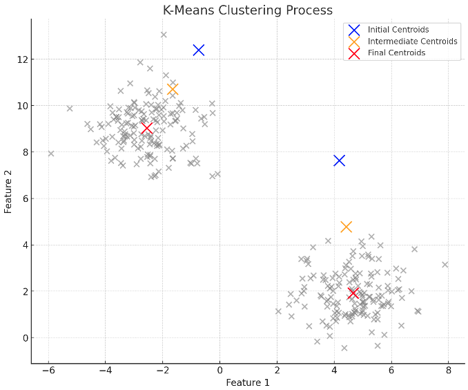
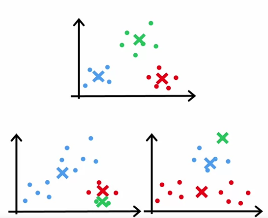
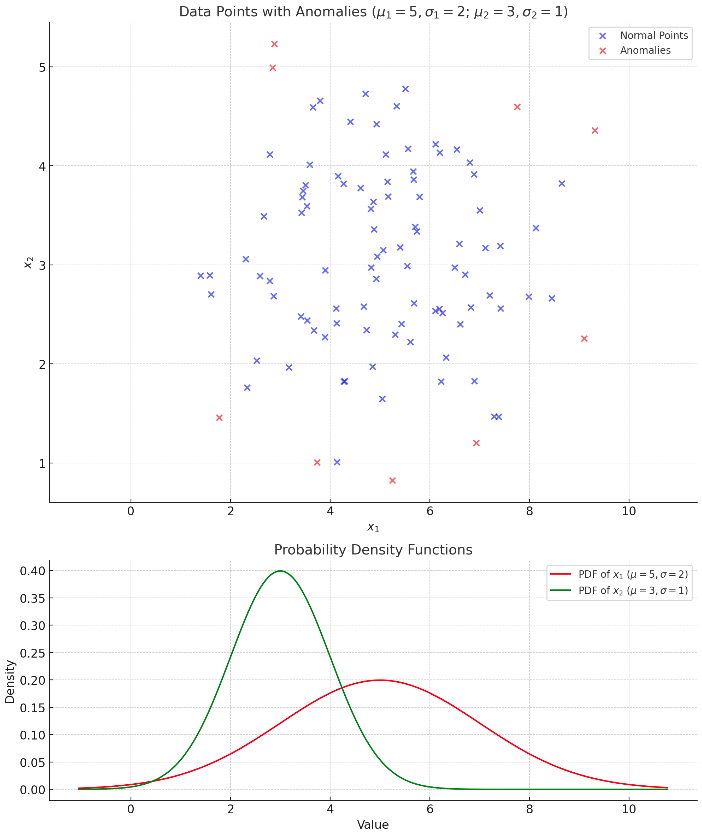
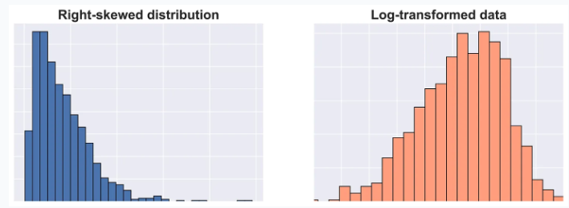

# Unsupervised Learning

- [Unsupervised Learning](#unsupervised-learning)
  - [Clustering](#clustering)
    - [K-Means Clustering](#k-means-clustering)
  - [Anomaly Detection](#anomaly-detection)
    - [Gaussian Distribution](#gaussian-distribution)
    - [Density Estimation](#density-estimation)
    - [Anomaly Detection Evaluation](#anomaly-detection-evaluation)
    - [Anomaly Detection vs Supervised Learning](#anomaly-detection-vs-supervised-learning)
    - [Feature Selection in Anomaly Detection](#feature-selection-in-anomaly-detection)


## Clustering

Clustering is an unsupervised learning technique used to group similar data points together. The goal is to find groups of data points that are similar to each other and dissimilar to data points in other groups.

### K-Means Clustering

K-means partitions the data points into k clusters. K needs to be specified by the user. The algorithm assigns each data point to the cluster with the nearest centroid. The centroid is the mean of all the data points in the cluster.

1. Randomly initialize $k$ cluster centroids $\mu_1, \mu_2, \ldots, \mu_k$
2. Assign each data point to the nearest centroid
```math
c^{(i)} = \text{argmin}_k ||x^{(i)} - \mu_k||^2
```
3. Update the centroids by calculating the mean of all the data points in the cluster
```math
\mu_k = \frac{1}{|C_k|} \sum_{i \in C_k} x^{(i)}
```
4. Repeat steps 2 and 3 until the centroids do not change or a stopping criteria is met

Cost function for a single cluster:
```math
J(c^{(1)}, \ldots, c^{(m)}, \mu_1, \ldots, \mu_k) = \frac{1}{m} \sum_{i=1}^{m} ||x^{(i)} - \mu_{c^{(i)}}||^2
```
Cost function for all clusters:
```math
J = \sum_{i=1}^k \sum_{x \in C_k} \| x - \mu_{c^{(i)}} \|^2
```

- $c^{(i)}$ index of cluster (1,2..,k) to which example $x^{(i)}$ is currently assigned
- $C_k$ is the set of data points assigned to cluster $k$
- $|C_k|$ is the number of data points assigned to cluster $k$
- $u_k$ is the centroid of cluster $k$
- $u_{c^{(i)}}$ is the centroid of the cluster to which example $x^{(i)}$ is currently assigned
- $m$ is the number of data points

If a cluster has no data points assigned, we can either remove the cluster or reinitialize the centroids.



**Random initialization**:
1. choose $k$ < m
2. Randomly select $k$ training examples
3. Set $\mu_1, \mu_2, \ldots, \mu_k$ equal to these $k$ examples

The cost function should go down with each iteration. The algorithm may converge to a local minimum, so it is recommended to run the algorithm multiple times (50-100) with different initializations and pick the set of clusters with the lowest cost (distortion).

Example for k = 3 clusters with different initializations and different local minima:



**Choosing the number of clusters $k$:**
- The elbow method: plot the cost function as a function of the number of clusters. The cost function will decrease as the number of clusters increases. The elbow point is the point where the cost function starts to decrease more slowly.
- It is often choosen based on domain knowledge.

## Anomaly Detection

Anomaly detection is used to identify data points that are significantly different from the rest of the data. Anomalies are also called outliers, novelties, noise, deviations, and exceptions.

Use cases:
- Fraud detection
  - Features of users activities, e.g. time of day, location, amount of transaction
  - Model $p(x)$ from the data
  - Identify data points with low probability $p(x) < \epsilon$
- Manufacturing
  - Features of machines, e.g. temperature, pressure, vibration
- Intrusion detection
  - Features of network traffic, e.g. number of packets, time of day, source IP address

### Gaussian Distribution

Probability is determined by the Gaussion (normal) distribution with mean $\mu$ and variance $\sigma^2$.
```math
p(x; \mu, \sigma^2) = \frac{1}{\sqrt{2\pi}\sigma} \exp \left( - \frac{(x - \mu)^2}{2\sigma^2} \right)
```
- $x$ is the data point
- $\mu$ is the mean of the data
- $\sigma^2$ is the variance of the data

Parameters $\mu$ and $\sigma^2$ are estimated from the data:
```math
\mu = \frac{1}{m} \sum_{i=1}^{m} x^{(i)}
```
```math
\sigma^2 = \frac{1}{m} \sum_{i=1}^{m} (x^{(i)} - \mu)^2
```

### Density Estimation

Dennsity estimation is used to model the distribution of the data. The goal is to find data that has low probability of occuring

```math
p(x_{\text{test}}) < \epsilon
```
- $p(x_{\text{test}})$ is the probability of the data point $x_{\text{test}}$
- $\epsilon$ is the threshold
  
**General Formula for Anomaly Detection**:
```math
p(x) = p(x_1; \mu_1, \sigma_1^2) \cdot p(x_2; \mu_2, \sigma_2^2) \cdot \ldots \cdot p(x_n; \mu_n, \sigma_n^2) = \prod_{j=1}^{n} p(x_j; \mu_j, \sigma_j^2)
```
- $x_i$ is the $i$-th feature of the data point $x$
- $\mu_i$ is the mean of the $i$-th feature
- $\sigma_i^2$ is the variance of the $i$-th feature
- $p(x_i; \mu_i, \sigma_i^2)$ is the probability density function of the $i$-th feature

The overall probability $p(x)$ is the product of the probabilities of each feature. Here we assume that the features are independent, which is not always the case but is a common assumption. If one of the features has a low probability, the overall probability will be low.

Example with two features $x_1$ and $x_2$:



### Anomaly Detection Evaluation

To evaluate the performance of the anomaly detection algorithm, we need labeled data.

Assume labeled data with: y = 0 for normal data and y = 1 for anomalies.

- **Training set:** $x^{(1)}, x^{(2)}, \ldots, x^{(m)}$ for all data with $y = 0$
- **Coss-validation set:** $x_{\text{cv}}^{(1)}, x_{\text{cv}}^{(2)}, \ldots, x_{\text{cv}}^{(m_{\text{cv}})}$ for all data with $y_{\text{cv}} = 0$ and $y_{\text{cv}} = 1$
- **Test set:** $x_{\text{test}}^{(1)}, x_{\text{test}}^{(2)}, \ldots, x_{\text{test}}^{(m_{\text{test}})}$ for all data with $y_{\text{test}} = 0$ and $y_{\text{test}} = 1$

Example with Airplane engine data (ratio good to faulty engines is very low):
- 10000 good engines (y = 0)
- 20 faulty engines (y = 1)

We add all the good engines to the training set fit the Gaussian distribution and calculate the mean and variance. We then use the cross-validation set to find the best threshold $\epsilon$.
- Training set: 6000 good engines
- Cross-validation set: 2000 good engines, 10 faulty engines
- Test set: 2000 good engines, 10 faulty engines

Event though we work with labeled data, it is still an unsupervised learning problem because we do not use the labels in the training process.

Evaluation Metrics on the cross-validation set:

```math
y = \begin{cases} 
1 & \text{if } p(x) < \epsilon \text{ (anomaly)} \\
0 & \text{if } p(x) \geq \epsilon \text{ (normal)}
\end{cases}
```

- True positive, false positive, true negative, false negative
- Precision/recall
- F1 score

### Anomaly Detection vs Supervised Learning

Anomaly detection:
- very small number of positive examples $y=1$ (anomalies) and large number of negative examples $y=0$. (0-20 examples is common)
- Many different types of anomalies are hard for an algorithm to learn. E.g. many different types of fraud or many different types of manufacturing defects. Future anomalies may look very different from the anomalies in the training set.

Supervised learning:
- large number of positive and negative examples
- Enough positives examples for the algorithm to learn. Future positive examples are likely to be similar to the positive examples in the training set.

### Feature Selection in Anomaly Detection

Correct feature selection is more important in anomaly detection than in supervised learning. Supervised learning algorithms can learn to ignore irrelevant features. Anomaly detection algorithms can be sensitive to irrelevant features.

Make sure features are more or less Gaussian distributed

Features that are not guassian distributed can be transformed with a log transformation or a square root transformation.
  
```math
x_i = \log(x_i + c)
```
```math
x_i = \sqrt{x_i} = x_i^{\frac{1}{2}}
```
The value of $c$ is choosen to avoid taking the log of zero. The value of $c$ is set experimentally.



All the transformations applied to the training set must also be applied to the cross-validation and test sets.
